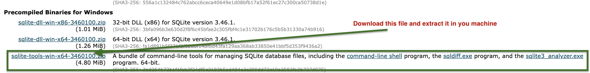
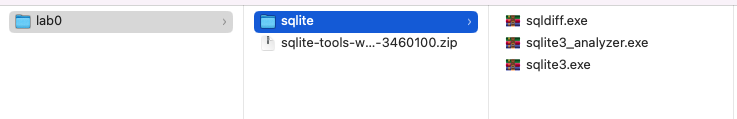
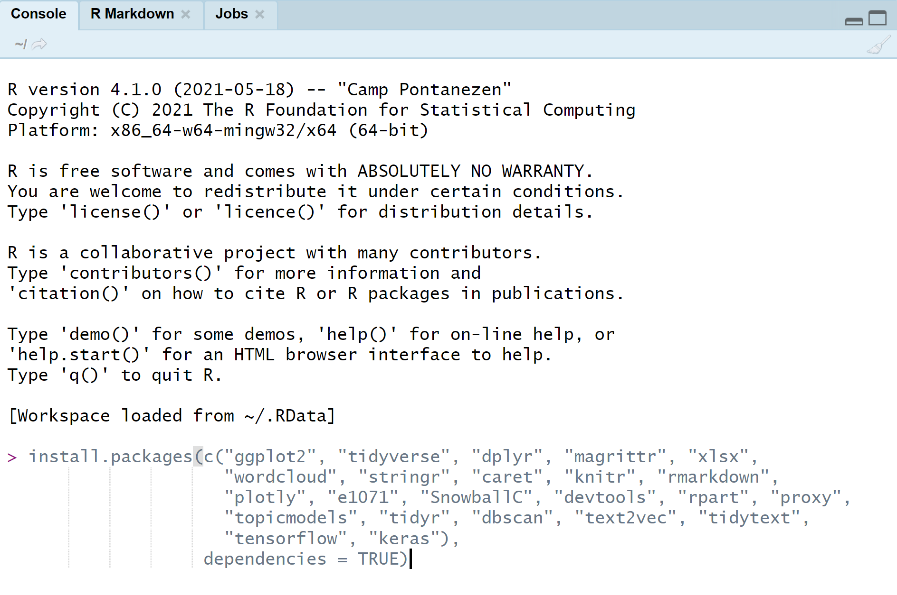

## Introduction

During this lab, you will get familiar with the most important tools that will be used during the course. These tools include ([SQLite](https://www.sqlite.org/download.html)), ([DB Browser](https://sqlitebrowser.org/)), ([Google Colab](https://colab.research.google.com/)) for Python and ([RStudio](https://posit.co/download/rstudio-desktop/)) for R.

## SQLite and DB Browser

In this course, we will use **SQLite** and its graphical interface **DB Browser** to create and query DBMSs. During this lab, you will install and use the DB Browser or SQLite3. As an example for a database, we will use the `Chinook` database. To download the `.sqlite` file, open the [Link](https://database.guide/2-sample-databases-sqlite/) and look for `Chinook_Sqlite.sqlite` and `Chinook_Sqlite.sql`. Right click on the link and `Save Link As ...` to download the file into a location of your choice.

::: callout-note
## SQLite3 (on MACOS)

For MAC users, sqlite is builtin command. To run sqlite just open your terminal and change the directory to your current working directory where you saved the databse. To create a database, type the following command in the terminal:

```sql
$ sqlite3 Chinook
```

This command will create a file `Chinook.db` in the working directory. To check if the database has been created correctly, you can run `.databases`from the bash of sqlite3 as follows:

```sql
sqlite3> .databases 
```

If the database has been created correctly, you should see the following output

```sql
main: /Users/.../Chinook r/w
```

Now, you can import the tables from the file `Chinook_Sqlite.sql` using:

```sql
sqlite3> .read Chinook_Sqlite.sql
```
**Note:** make sure that you downloaded `Chinook_Sqlite.sql` and it is in the current working directory. Otherwise, you should specify the path to the `.sql` file. 

It will take a few seconds to import the database. After that, you can list the tables that exist in the database using:

```sql
sqlite3> .tables
```

If the database was imported correctly, you should see the following list of tables: *\[Album, Employee, InvoiceLine, PlaylistTrack, Artist, Genre, MediaType, Track, Customer, Invoice, Playlist\]*

However, if you have downloaded `Chinook_Sqlite.sqlite`, you cannot use `.read`. Instead, use `.open` because `Chinook_Sqlite.sqlite` is a binary database file and not `SQL` code (plain text).

**Browsing the database in `Chinook_Sqlite.sqlite`:**
The file `Chinook_Sqlite.sqlite` contains the whole database so you can open it directly using:
```sql 
sqlite3 Chinook_Sqlite.sqlite
```
then you can see the database and perform basic queries on it. 

:::

::: callout-note
## SQLite3 (on Windows)


For MS-Windows user, download the file `sqlite-tools-win-x64-3460100.zip`from ([SQLite](https://www.sqlite.org/download.html)) and store it a specific location (let us say 'infomdwr/lab0/).

{width=100%}

Extract the downloaded file and the change the directory name to sqlite (as in the fingure). 
{width=100%}

After extracting the files, open the `Windows PowerShell` and change the working directory to the `infowmdwr/lab0/sqlite` directory that contains the sqlite executable files. Now you can follow the same steps as the MACOS users except that to run sqlite3, you need to use: 
```sql
> ./sqlite3 Chinook
```
Instead of: 
```sql
$ sqlite3 Chinook
```
for the MAC users. 

:::

::: callout-note
## DB Browser

In DB Browser, you can use the graphical interface to create the `Chinook` database. To import the database from the file `Chinook_Sqlite.sql`, open the `File` menu and select `import > Database from SQL file ...`. Change to the location where you saved the file `Chinook_Sqlite.sql` and select it. You will be asked if you want to create a new databse or not. Since we have created a new database, you select `No`. If the database is imported correctly, you will see the number of tables changed from 0 to 11.

Now, we need to get familiar with executing a simple SQL query that returns the names of the tables in the database. Unlike using sqlite3, we should use the `Execute SQL` tool. When selecting the `Execute SQL`, you will see a text box. Type the query:

```{sql}
SELECT name FROM sqlite_schema
WHERE type ='table' AND 
      name NOT LIKE 'sqlite_%';
```

After executing the query, you should see a table with the names of the 11 tables in the database.
:::

## Google Colab for Python

For simplicity, we will use Google Colab for running the Python programs during the course. If you are familiar with other Integrated Development Environment such as Anaconda, PyCharm or Spyder, then use that IDE. Be careful that specific libraries may run only under a specific version of Python.

::: callout-note
## Google Colab

We will start by creating a new new notebook and checking the version of Python that is already installed. We run the command:

```{python}
!python --version
```

If we need to install a different version of Python (e.g. 3.7), we can use:

```{python}
!apt-get install python3.7
```

### Installing more Libraries

Most of the important libraries that we may need are already installed in the Google Colab environment. However, if you would like to install additional libraries, you can use the `pip` command. For example, to install `py_stringmatching`, you can use the command:

```{python}
!pip install py_stringmatching
```

**Note:** when running system commands in Google colab, we use `!` before the command (this is common for running system commands in any notebook environment).

### Running simple Python code

Run the following Python code and explain what the code is doing:

```{python}
t, f = True, False
print(t and f) 
print(t or f)  
print(not t)   
```
:::


## R & RStudio
We will be using the most popular development environment for R: RStudio. In the exercises below (and the readings for this lab from [R4DS](https://r4ds.hadley.nz/)) you will set up your computer for doing the R practicals in later parts of this course.

::: callout-note
## R & RStudio

### Installing R & RStudio
Install R and RStudio as per the instructions in the syllabus [here](https://infomdwr.nl/syllabus#required-software).

### Installing additional packages
Open RStudio, find the console window (the [REPL](https://en.wikipedia.org/wiki/Read%E2%80%93eval%E2%80%93print_loop)) and type the following code:

```{r}
2 + 2
```

This should return `4`.

If you are not sure where to execute code, use the following figure to identify the console:

<center>
  
</center>

To install packages in R, we use R directly (unlike in python where we commonly use the pip module). Install the [tidyverse](https://www.tidyverse.org/) suite of packages.

```{r}
install.packages("tidyverse")
```

If you are asked 

```
Do you want to install from sources the package which needs 
compilation? (Yes/no/cancel)
```

type `no` in the console and press the return key.


Did this all go well? Explain to your neighbour what just happened. What is tidyverse? 

### Required R knowledge
The following is the minimum of what you should know about `R` before starting with the first R practical later in the course. Take some time to explore these points! Look up things on the internet if you are unsure.

- What is `R` (a fancy calculator) and what is an `.R` file (a recipe for calculations)
- What is an `R` package (a set of functions you can download to use in your own code)
- How to run `R` code in `RStudio`
- What is a variable `x <- 10`
- What is a function, e.g., `y <- sqrt(x = 23)`
- Understand what the following statements do (tip: you may run it in `R` line by line)

```{r}
y <- "What?"
x <- "R!"
z <- paste(x, "Data wrangling and analysis is cool.", y)
rep(z, 3)
1:10
sample(1:20, 4)
sample(1:20, 40, replace = TRUE)
z <- c(1, 2, 3, 4, 5, 4, 3, 2, 1)
z^2
z == 2
z > 2
```

- Be able to read the help file of any function, (e.g., type `?plot` in the console)

:::