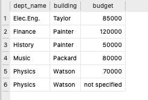

In this lab, you will work on creating tables (relations) and adding/deleting records to/from the tables. You will learn also how to modify a database by altering the tables (adding/deleting attributes) or even deleting the whole table.
When writing the `SQL` queries, it is good to keep a copy of the queries in a plain text document so that you can use them later (if needed).  

**Note:** we will use table and relation exchangeable unless something else is specified. 


## Creating table

During the first weeks of the course, we will use the University database from the Database System Concepts book. Over the first two weeks of the course, it would be good to create all the tables and enter a few records in the ***student, instructor and department*** relations.  

* Write the `SQL` query that creates one or more tables. For now, you don't need to specify the primary/foreign keys or any additional constraints. Just the data type of each attribute. 

{width=100%}

::: callout-note
- Creating the student relation
```sql
  CREATE TABLE student (
	  id CHAR(20), 
	  name CHAR(20), 
	  dept_name CHAR(20),
	  tot_cred INTEGER   
  );
``` 

- Creating the instructor relation
```sql
  CREATE TABLE instructor (
    ID varchar(5),
    name varchar(20),
    dept_name varchar(20),
    salary numeric(8, 2)
  );
```

- Creating the department relation
```sql
  CREATE TABLE department (
    dept_name varchar(20),
    building varchar(15),
    budget numeric(12, 2)
  );
```
:::

::: callout-note
## Inserting records into a table

- Write `SQL` queries to insert a few records in each of the created tables. 

Inserting records in the student table
```sql
  INSERT INTO "student" VALUES ('00128','Zhang','Comp. Sci.',102);
  INSERT INTO "student" VALUES ('12345','Shankar','Comp. Sci.',32);
  INSERT INTO "student" VALUES ('19991','Brandt','History',80);
  INSERT INTO "student" VALUES ('23121','Chavez','Finance',110);
  INSERT INTO "student" VALUES ('44553','Peltier','Physics',56);
  INSERT INTO "student" VALUES ('45678','Levy','Physics',46);
  INSERT INTO "student" VALUES ('54321','Williams','Comp. Sci.',54);
  INSERT INTO "student" VALUES ('55739','Sanchez','Music',38);
``` 

Inserting records in the instructor table
```sql
  INSERT INTO "instructor" VALUES ('10101','Srinivasan','Comp. Sci.',65000);
  INSERT INTO "instructor" VALUES ('12121','Wu','Finance',90000);
  INSERT INTO "instructor" VALUES ('15151','Mozart','Music',40000);
  INSERT INTO "instructor" VALUES ('22222','Einstein','Physics',95000);
  INSERT INTO "instructor" VALUES ('32343','El Said','History',60000);
  INSERT INTO "instructor" VALUES ('33456','Gold','Physics',87000);
  INSERT INTO "instructor" VALUES ('45565','Katz','Comp. Sci.',75000);
  INSERT INTO "instructor" VALUES ('58583','Califieri','History',62000);
```

Inserting records in the department table

```sql
  INSERT INTO "department" VALUES ('Biology','Watson',90000);
  INSERT INTO "department" VALUES ('Comp. Sci.','Taylor',100000);
  INSERT INTO "department" VALUES ('Elec. Eng.','Taylor',85000);
  INSERT INTO "department" VALUES ('Music','Packard',80000);
``` 

- Check if you can enter values of different type other than the type of the attribute (e.g. enter strings for attributes with numeric type). Comment on your findings. 
We can insert the following record with no problems as the DBMS uses dynamic typing so data of any type can be inserted in almost any attribute. 
```sql
  INSERT INTO "department" VALUES ('Physics','Watson',"not specified");
``` 
When checking if the record was inserted correctly or not, we use:
```sql
  SELECT * FROM department;
```
>> We can see the output as follows:

{width=40%}

:::

## Modifying the tables
* Write an `SQL` query to add an attribute *major* in the *student* table. 
```sql
ALTER TABLE STUDENT ADD COLUMN MAJOR;
``` 
* If you have inserted a few records in the student table before, display the records of the table and check the values in the *major* attribute. 
```sql
SELECT * FROM STUDENT;
``` 
>> We can see the output as follows:

{width=40%}


* Before performing the next tasks, make sure that you have the query for creating the tables that you will work on and you have the queries for inserting the records again. 
  + Delete all the records from the table. Make sure that the table itself is not deleted. 
  ```sql
      DELETE FROM STUDENT;
  ``` 
  >>This query will delete the data but not the schema.
  
  + Delete the table and its content. Comment on the differences between the two queries. 
  ```sql
      DROP TABLE student;
  ``` 
  >>This query will delete the data and the schema. 


