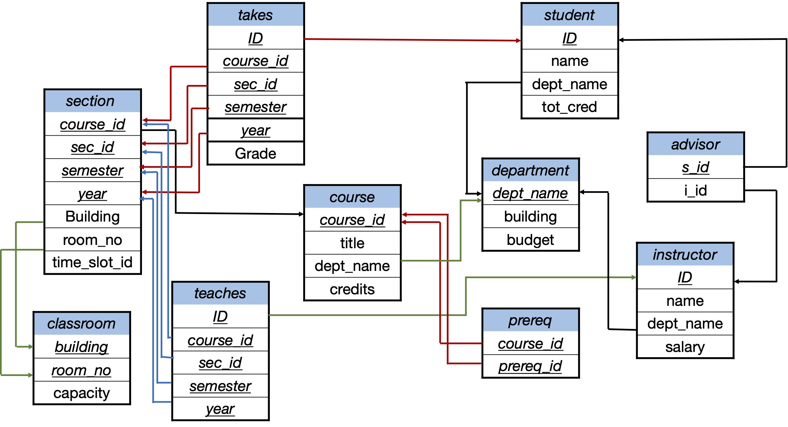

In this lab, you will work on querying databases using relational algebra and SQL. The exercises in this lab are similar to the examples that you studied during the lecture. The purpose of the lab sessions is to get the hands-on experience that is required for future career. 

The exercises in this lab are based on the university database from the Database System Concepts.




::: callout-note
## Relational algebra

Write the following queries in relational algebra:

a.	Find the titles of courses in the `Comp. Sci.` department that have 3 credits.

$$\pi_{title}(\sigma_{dept\_name = 'Comp. Sci.'\ \wedge \ credits = 3}(course)) $$

b.	Find the IDs of all students who were taught by an instructor named `Einstein`.

$$ \pi_{ID}(takes \bowtie \pi_{course\_id}(teaches\bowtie\sigma_{name = 'Einstein'}(instructor)))$$
c.	Find the highest salary of any instructor.

$$\gamma_{max(salary)}(instructor)$$
d.	Find all instructors earning the highest salary (there may be more than one with the same salary).

$$\sigma_{salary = \gamma_{max(salary)}(instructor)} (instructor)  $$

e.	Find the enrollment of each section that was offered in Fall 2009. 

$$ _{sec\_id} \gamma_{count(*)\ as\ enrolment} (\sigma_{year = 2009 \ \wedge\ semester = 'Fall'}(takes))$$
:::  


## SQL


For `SQL`, we will have two types of exercises. Type1, you need to interpret and understand the outcomes of an `SQL`  Query. Type2, You will need to write your `SQL` query to extract specific piece of data. 


::: callout-note
### Running SQL queries

To run these queries, download the university database `univdb-sqlite.db` from [here](https://www.db-book.com/university-lab-dir/sqlite-tips.html). The database contains a table `time_slot` that is not included in the schema diagram. After that, execute these queries and describe the task that they are supposed to perform and comment on the query outputs.

Q1. SELECT-FROM-WHERE
```sql
    SELECT ID, name, dept_name
        FROM student
        WHERE dept_name < "Finance";
```
This query will display the 'ID', 'name', 'dept_name' of students who belong to a department with name precedes the name 'Finance' according to the oreder of letter based on their ASCII code. In the university database, these departments will be 'Biology', 'Comp. Sci.' and 'Elec. Eng.'.

Q2. Using DISTINCT
```sql
    SELECT DISTINCT dept_name          
        FROM student;
```
It will return the names of the departments who has students records in the database. For the university database, this will be 'Comp. Sci.', 'History', 'Finance', 'Physics', 'Music', 'Elec. Eng.', 'Biology'. 
The name of the department will appear only one time regardless of the number of students in the department. 

Q3. Using ALL
```sql
    SELECT ALL dept_name                 
		    FROM student
```
It will return the names of the departments who has students records in the database. The name of the department will appear as many times as the number of students in the department. For example, 'Comp. Sci.' will appear 4 times according to the records in the university database. 

Q4. Using named literal attribute
```sql	
    SELECT 'MyName' as 'V1';
```
Will return a relation with a single attribute 'V1'and this attribute has a single value 'MyName'.

Q5. Using literal attribute with `FROM`
```sql 	
    SELECT 'A'  FROM student;
```
Will return a relation with a single attribute 'A' and this attribute has 13 cells  (similar to the number of records in the student relation) with a value 'A'. 

Q6. Performing calculations on the Query output 
```sql 	
    SELECT dept_name, building, budget, (budget + (budget * 0.15)) as new_budget 
    FROM department; 
``` 
This query will return a relation with attributes 'dept_name', 'building', 'budget', and 'new_budget'. The new_budget is increased by 15%  than the original budget. 

Q7. Join
```sql
    SELECT name, course_id, sec_id
		FROM student, takes
		WHERE student.ID = takes.ID 
				and sec_id = 2;
```
This query will return a relation with attributes 'name', 'course_id', 'sec_id' who are attending in the section with sec_id = 2. 

Q8. Self-join 
```sql
    SELECT * FROM student as S1, student as S2 
		WHERE S1.dept_name = S2.dept_name 
			AND S1.name <> S2.name;
```
This query will return a relation with the information of students who are in the same department. Each record in the new relation will contain the information of two students from the same department.

Q9. Left-outer-join
```sql
    SELECT * FROM student 
    JOIN takes  
    ON student.ID = takes.ID;
```
This query will return a relation with the information of the students and the courses they have taken with their grades. The records that will be in the resulting relation should have the student ID in both tables. 

* What will be the difference when using LEFT OUTER JOIN instead of JOIN

In this case, all students should appear in the resulting relation even if the student didn't take any courses. If a student didn't take any courses, the course information will be replaced by null.

::: 


::: callout-note
### Writing SQL queries

In this part, you will write your own `SQL` queries to perform the following tasks. 

1.  Write a query that returns the information of the students and the courses they have taken.
```sql
    SELECT * FROM student 
    JOIN takes  
    ON student.ID = takes.ID; 
```

2. SQLite supports LEFT OUTER JOIN only. How do we rewrite the following query on SQLite.
```sql
    SELECT * FROM studen 
    Right outer JOIN takes  
    ON student.ID = takes.ID;
```
We can do that by changing RIGHT OUTER JOIN to LEFT OUTER JOIN and switch the position of the tables around the join operator as follows:
```sql
    SELECT * FROM takes 
    LEFT outer JOIN studen  
    ON student.ID = takes.ID;
```


3. SQLite supports only LEFT OUTER JOIN. How can rewrite the following query on SQLite.
```sql
    SELECT * FROM student 
    FULL outer JOIN takes  
    ON student.ID = takes.ID;
```
We can do that by performing LEFT OUTER JOIN twice where both table will switch places around the join operator and taking the union of the results of both queries as follows:

```sql
    SELECT S.ID, S.name, S.tot_cred, S.dept_name, T.course_id, 
        T.sec_id, T.semester, T.year, T.Grade  FROM student S
    lEFT outer JOIN takes T  
    ON S.ID = T.ID
    UNION 
    SELECT S.ID, S.name, S.tot_cred, S.dept_name, T.course_id, 
        T.sec_id, T.semester, T.year, T.Grade FROM takes T
    LEFT outer JOIN student S  
    ON S.ID = T.ID;
```
We are listing the set of attributes so that the order of the values will not change when taking the union. For this database, taking `student left outer join takes` will produce the required results but this is not true for general cases. 


4. Write a query that finds the names of all students that contain the substring “an” in their names

```sql
    SELECT name FROM student 
    WHERE name LIKE '%an%';
```
5. Write a query that returns the names and tot_cred of students with total credits between 32 and 80 (inclusive)

```sql
  SELECT name, tot_cred FROM student 
  WHERE tot_cred >= 32 and tot_cred <= 80;
```

6. Write a query that returns the information of the students in the department Biology and Physics using set operations
```sql
  SELECT * FROM student 
  WHERE dept_name = 'Biology' 
  union  
  SELECT * FROM student 
  WHERE dept_name = 'Physics';
```

7. Write a query that returns the information of all students except the students in the computer science department using set operations

```sql
  SELECT * FROM student
  Except 
  SELECT * FROM student WHERE dept_name = 'Comp. Sci.';

```

8. Given the query:
```sql
    SELECT dept_name, avg(salary) avg_salary 
    FROM instructor
    Group by dept_name
    HAVING avg_salary > 70000;
```

  - What does this query do?
  This query will return the names of the departments where the average instructor salary is strictly greater than 70000 with the average salary of the instructors in those departments. 
  - Why we used HAVING?
  Because we used GROUP BY so we cannot use WHERE to specify the condition. 
  - What about replacing HAVING by WHERE?
  If we would like to replace HAVING by WHERE the we need to use a subquery as follows:

```sql
  SELECT dept_name, avg_salary FROM 
    (SELECT dept_name, avg(salary) avg_salary FROM instructor
    Group by dept_name)
  WHERE avg_salary > 70000;
```

