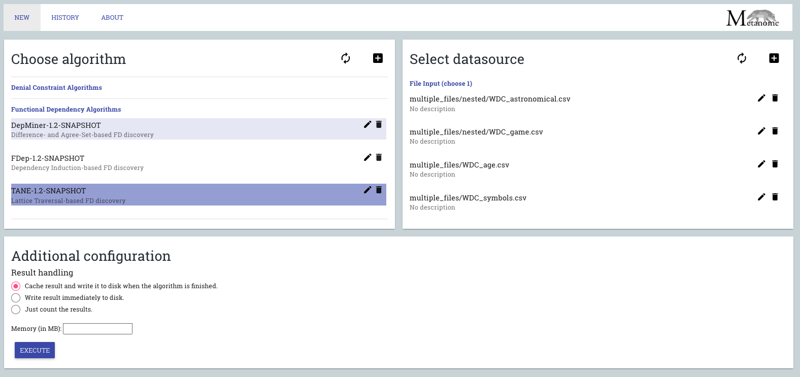

 

## Exercises

::: callout-note
### Lossless decomposition of relations

* Suppose that we decompose the schema $R = (A, B, C, D, E)$ into 
$$
\begin{aligned}  
& R_1 = (A, B, C) \\
& R_2 = (A, D, E)
\end{aligned}
$$
Show that this decomposition is a lossless decomposition if the following set $\mathcal{F}$
of functional dependencies holds:
$$  
\begin{aligned}  
&A \mapsto BC \\
&CD \mapsto E \\
&B \mapsto D \\
&E \mapsto A 
\end{aligned}
$$


**Solution:** A decomposition $\{R_1, R_2\}$ is a lossless decomposition if $R_1 \cap R_2 \mapsto R_1$ or
$R_1 \cap R_2 \mapsto R_2$. 

Let $R_1 = (A, B, C)$, $R_2 = (A, D, E)$, then $R_1 \cap R_2 = A$.
Since $A \mapsto BC$ then $A \mapsto B$ and $A \mapsto C$. Therefore, $A \mapsto R_1$.
Hence $A$ is a candidate key in $R_1$, which implies that the $R_1 \cap R_2 \mapsto R_1$.

:::


::: callout-note
### BCNF 

* Show that if we combine the relations `instructor` and `department` into `in_dep (ID, name, salary, dept_name, building, budget)` then the resulting relation is not in Boyce–Codd normal form (BCNF).  

**Solution:** For a relation $R$ to be in the BCNF, any FD  $X \mapsto Y$ with $X\subseteq R$ and $Y\subseteq R$ should satisfy:

* Either $𝑋\mapsto𝑌$ is a trivial FD OR
* $X$ is a superkey for $R$

However, we know that $dept\_name \mapsto budget$ but $dept\_name$ are two non-trivial FDs whereas the $dept\_name$ is not a superkey in the relation `in_dep` as multiple instructors may work for the same department. 

:::

::: callout-note
### Alternative Definition of the Keys

* The Functional dependencies $R(A,B,C,D,E,F,G)$ is given: 
$$
\begin{aligned}  
\mathcal{F} =  &\{ \\ 
&ABD \mapsto EG,\\
&C \mapsto DG, \\
&E \mapsto FG, \\
&AB \mapsto C, \\
&G \mapsto F\\
&\}.\\
\end{aligned}
$$
Find the candidate key for $R$.

**Solution:** We use Armstrong’s axioms to decompose and merge the FD’s and prove that attributes $AB$ determines all other attributes in the relation.

$$
\begin{cases}
C \mapsto DG
\end{cases}
\quad \implies \left\lbrace
\begin{array}{r@{\;}l} % make space to RHS of \in and = symbols equal to that used for mathrel items
 C \mapsto D \\
 C \mapsto G 
\end{array}
\right.
$$ 

 $$
\begin{cases}
AB \mapsto C\\
C \mapsto D \\
C \mapsto G  \\
G \mapsto F
\end{cases}
\quad \implies \left\lbrace
\begin{array}{r@{\;}l} % make space to RHS of \in and = symbols equal to that used for mathrel items
 AB \mapsto C \\
 AB \mapsto D \\
 AB \mapsto G \\
 AB \mapsto F
\end{array}
\right.
$$


$$
\begin{cases}
ABD \mapsto EG\\
AB \mapsto D 
\end{cases}
\quad \implies 
\begin{array}{r@{\;}l} % make space to RHS of \in and = symbols equal to that used for mathrel items
 AB \mapsto EG 
\end{array}
\quad \implies \left\lbrace
\begin{array}{r@{\;}l} % make space to RHS of \in and = symbols equal to that used for mathrel items
 AB \mapsto E \\
 AB \mapsto G
\end{array}
\right.
$$

Since $AB$ determines all the other attributes so $AB$ is a key candidate and since no single attribute can determine all other attributes, $AB$ is a primary key. 


:::


::: callout-note
### Discovering FDs

* Given the relation:

| A  |  B |  C |
| -- | -- | -- |
| a1 | b1 | c3 |
| a1 | b1 | c3 |
| a2 | b1 | c1 |
| a2 | b1 | c1 |
| a3 | b1 | c1 |

List all nontrivial functional dependencies satisfied by the relation. 

**Solution:** The nontrivial functional dependencies are: $A \mapsto B$, $C \mapsto B$ and $A \mapsto C$. By augmentation, we can derive that $AC \mapsto B$ and $AB \mapsto C$. $C$ does not functionally determince $A$ because in the last three rows $C$ takes the value $C1$ whereas $A$ takes two values $a2$ and $a3$.
:::

::: callout-note
### Practical example

In the [University Database (`univdb-sqlite.db`)](https://www.db-book.com/university-lab-dir/sqlite-tips.html), perform the following tasks:

- Join the relations  `instructor` and `department` into `in_dep (ID, name, salary, dept_name, building, budget)` and display the content of the new relation. 

**Solution:** we start by creating a new table `in_dep`: 
```sql
CREATE TABLE  in_dep (
	"ID"	varchar(5),
	"name"	varchar(20) NOT NULL,
	"i_dept_name"	varchar(20),
	"salary"	numeric(8, 2) CHECK("salary" > 29000),
	"d_dept_name"	varchar(20),
	"building"	varchar(15),	
	"budget"	numeric(12, 2) CHECK("budget" > 0)
	);
```
After that, we copy the content of the join into the newly created table:

```sql
  INSERT INTO in_dep SELECT * FROM instructor I
  JOIN department D
  on I.dept_name = D.dept_name
```
To display the content of the new relation, we use:
```sql 
  select * from in_dep
```

- Save the resulting relation in the database. 

This step is done when we created the table and copied the results of the join query inside the table.

- Split the relation  back into two relation `instructor_1 (ID, name, dept_name, salary`) and `department_1(dept_name, building, budget)`. 

**Solution:** we will create two new relations similar to the original relations of instructor and department but we will not specifiy the primary/foreign keys as follow:
```sql
  CREATE TABLE IF NOT EXISTS "instructor_1" (
	  "ID"	varchar(5),
	  "name"	varchar(20) NOT NULL,
	  "dept_name"	varchar(20),
	  "salary"	numeric(8, 2) CHECK("salary" > 29000)
);
INSERT INTO instructor_1 SELECT ID, name, i_dept_name, salary FROM in_dep;
```
Table instructor_1 will include exactly the same data as table instructor. 
```sql
  CREATE TABLE IF NOT EXISTS "department_1" (
	  "dept_name"	varchar(20),
	  "building"	varchar(15),
	  "budget"	numeric(12, 2) CHECK("budget" > 0)
);
INSERT INTO department_1 SELECT d_dept_name, building, budget from in_dep
```
We will see that the table department_1 will contain duplicate records for those departments with more than one professor. SQL allows for having duplicates. However, we can copy only the recors with distinct dept_name as:

```sql
  CREATE TABLE IF NOT EXISTS "department_1" (
	  "dept_name"	varchar(20),
	  "building"	varchar(15),
	  "budget"	numeric(12, 2) CHECK("budget" > 0)
);
INSERT INTO department_1 SELECT distinct d_dept_name, building, budget from in_dep
```

- Compare the entries in the `department` relation with those in the `department_1` and those in the `instructor` with those in the `instructor_1`. Comment on your findings. 

The new tables will include the same data as the original ones when inserting only the distinct records in the table department_1. Based on that, if we join the tables again then we will get the same table in_dep. That means, splitting table in_dep into instructor_1 and department_1 is lossless decomposition. 


- Now, split the relation back into two relation `instructor_2 (ID, name, dept_name, salary, budget`) and `department_2(building, budget)`.

We perform the same tasks as before.
```sql
  CREATE TABLE IF NOT EXISTS "instructor_2" (
	  "ID"	varchar(5),
	  "name"	varchar(20) NOT NULL,
	  "dept_name"	varchar(20),
	  "salary"	numeric(8, 2) CHECK("salary" > 29000),
	  "budget"	numeric(12, 2) CHECK("budget" > 0)
);
INSERT INTO instructor_2 SELECT ID, name, i_dept_name, salary, budget FROM in_dep;
```

```sql
  CREATE TABLE IF NOT EXISTS "department_2" (
	  "building"	varchar(15),
	  "budget"	numeric(12, 2) CHECK("budget" > 0)
  );
INSERT INTO department_2 SELECT building, budget FROM in_dep;
```

- Join relations `instructor_2` and `department_2` into `in_dep_2 (ID, name, salary, dept_name, building, budget)`

```sql
CREATE TABLE  in_dep_2(
	"ID"	varchar(5),
	"name"	varchar(20) NOT NULL,
	"dept_name"	varchar(20),
	"salary"	numeric(8, 2) CHECK("salary" > 29000),
	"i_budget"	numeric(12, 2) CHECK("i_budget" > 0),
	"building"	varchar(15),	
	"d_budget"	numeric(12, 2) CHECK("d_budget" > 0)
	);
```
```sql
  INSERT INTO in_dep_2(ID, name, dept_name, salary, i_budget, building, d_budget) SELECT * FROM instructor_2 I
  JOIN department_2 D
  on I.budget = D.budget
```

- Compare the `in_dep_2` relation with `in_dep`.

in_dep_2 will contain more records, which are duplicate. If we select only the distinct records then we will have the same set of records because in the available data, the budget contains unique values. 

- Split back the `in_dep_2` relation into `instructor_2 (ID, name, dept_name, salary`) and `department_2(dept_name, building, budget)`.

We will start by deleting the existing instructor_2 table and create a new one as follows:
```sql
  DROP TABLE instructor_2;
  CREATE TABLE IF NOT EXISTS "instructor_2" (
	  "ID"	varchar(5),
	  "name"	varchar(20) NOT NULL,
	  "dept_name"	varchar(20),
	  "salary"	numeric(8, 2) CHECK("salary" > 29000)
);
INSERT INTO instructor_2 SELECT ID, name, dept_name, salary FROM in_dep_2;
``` 

Similarly, we will delete the existing department_2 table and create a new one:

```sql
  DROP TABLE department_2;
  CREATE TABLE IF NOT EXISTS "department_2" (
    "dept_name"	varchar(20),
	  "building"	varchar(15),
	  "budget"	numeric(12, 2) CHECK("budget" > 0)
  );
INSERT INTO department_2 SELECT dept_name, building, d_budget FROM in_dep_2;
```

Compare the entries in the `department` relation with those in the `department_2` and those in the `instructor` with those in the `instructor_2`. Comment on your findings.

Tables instructor_2, department_2 will contain extra duplicate records. We can remove them using 
```sql
SELECT distinct * from instructor_2 
``` 
and 
```sql
SELECT distinct * from department_2 
``` 

We are sure that the second split is lossless. However, this is not completely clear using the current database since the budget in the table department has unique values even though the attribute is not a PRIMARY/UNIQUE key. 

:::

## Discovering functional dependencies using Metanome

::: callout-note
### FD Discovery 
Download the [Metanome profiler](https://hpi.de/naumann/projects/data-profiling-and-analytics/metanome-data-profiling.html) and a set of the functional dependency discovery algorithms, run one of the algorithms on csv file (you can find examples of datasets on the same website), and report the discovered FDs. Metanome is built using `JAVA`so you will need to install it on your computer.  

**Solution:** You will need to follow the following steps:

* If you don't have java on your machine, you will need to install it. Check [link](https://www.oracle.com/java/technologies/downloads/) for instructions and available versions. 

* Download Metanome from the [link](https://hpi.de/fileadmin/user_upload/fachgebiete/naumann/projekte/repeatability/DataProfiling/Metanome/deployment-1.2-SNAPSHOT-package_with_tomcat.zip). 
* Extract the contents of the zip file and save the content in a folder of your choice. 
* Download the algorithms [Tane](https://hpi.de/fileadmin/user_upload/fachgebiete/naumann/projekte/repeatability/DataProfiling/Metanome_Algorithms/TANE-1.2-SNAPSHOT.jar), [fdep](https://hpi.de/fileadmin/user_upload/fachgebiete/naumann/projekte/repeatability/DataProfiling/Metanome_Algorithms/FDep-1.2-SNAPSHOT.jar) and [FastFDs](https://hpi.de/fileadmin/user_upload/fachgebiete/naumann/projekte/repeatability/DataProfiling/Metanome_Algorithms/FastFDs-1.2-SNAPSHOT.jar) and move them inside the folder (...../deployment-1.2-SNAPSHOT-package_with_tomcat/backend/WEB-INF/classes/algorithms/).
* Open Windows Powershell or Mac/ Linux terminal and change the current working directory to the directory (...../deployment-1.2-SNAPSHOT-package_with_tomcat/) and type (./run.sh). You may need to use run.bat for Windows. Wait until the server starts correctly. 
* Open a web browser and type (http://localhost:8080/) in the address bar. You will see the user interface of the tool. You should be able to see the algorithms as in the figure below.  
* Try to run one of the algorithms on the available datasets. and record your findings. 
* If you want to use your own data, copy the csv files into (...../deployment-1.2-SNAPSHOT-package_with_tomcat/backend/WEB-INF/classes/inputData/).



::: 