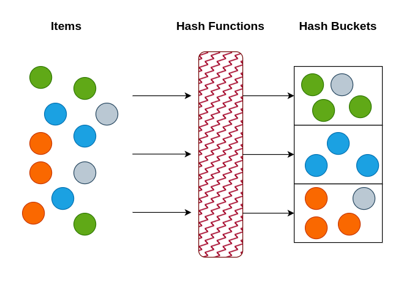

In this lab, you will practice to compute the similairty between different strings and sets. You will use different atomic similarity measures. Moreover, you will practice to find the similarity between different documents using min-hash and locality sensitive hashing beside the traditional ones (Jaccard similarity, Sørensen Coefficient, Tversky Index and the Overlap Coefficient)

## Atomic String Similarity
In the following exercises, you will learn about finding the simiarity between atomic values using Edit-Distance, Jaro Similarity, Jaro-Winkler Similarity and Soundex). We will start by importing the required libraries.


```python
import pandas as pd
import csv
import numpy as np
```
::: callout-note
#### Minimum Edit Distance (Levenshtein)


```python
'''
TODO: find an implementation of the Levenshtein minimum edit distance and use it 
to find the similarity between INTENTION and EXECUTION
'''
def ldist(s, t):
    
    return None

print("Minimum edit disctance = ", ldist("INTENTION", "EXECUTION"))
```


```python
'''
TODO: Modify the ldist function to accept a new parameter which specifies the substitution cost
Test your implementation with the call mod_ldist("Intention", "execution", 1) -- You should get 5
and mod_ldist("Intention", "execution", 2) -- You should get 8
'''
def mod_ldist(s, t, sub_cost):
    
    return None
  

print("Minimum edit disctance = ", mod_ldist("INTENTION", "EXECUTION", 2))
```

:::

::: callout-note
#### Jaro Similarity


```python
'''
TODO: find an implementation of the Jaro similarity algorithm and use it 
to find the similarity between the follwing pairs of strings:
('nichlseon','niechlson'),
('MARTHA', 'MARHTA'),
('DIXON', 'DICKSONX'),
('JELLYFISH', 'SMELLYFISH'),
('cunningham', 'cunnigham'), 
('shackleford', 'shackelford'),
('nichleson', 'nichulson'), 
('arnab', 'urban'),
('DATASCIENCE','SCIENCEDATA')
'''
def jaro(s, t):
    
    return None
```

:::

::: callout-note
#### Jaro-Winkler Similarity


```python
'''
TODO: find an implementation of the Jaro-Winkler similarity algorithm and use it 
to find the similarity between the pairs of strings in the previous exercise. 
Compare the results and comment on them.
'''
def jaro_winkler(s, t, p = 0.1):
    
    return None
```

:::

::: callout-note
#### Soundex


```python
'''
TODO: find an implementation of the soundex algorithm and use it 
to find the representation of EDUCATE and EVALUATE
'''
```
:::

### Similarity for Sets

For this exercise, you may use a tokenizing function that convert the following sentences into sets of words (words are separated by spaces). After that, apply Jaccard, Sørensen Coefficient, Tversky Index, Overlap Coefficient). 

```
D1 = People wearing costumes are gathering in a forest and are looking in the same direction	
D2 = People wearing costumes are scattering in a forest and are looking in different directions
D3 = People wearing costumes are gathering in a forest and are looking in the same direction	
D4 = Masked people are looking in the same direction in a forest
```

Compute the pairwise similarity between the documents using the four measures.


```python
'''
TODO: first step is to tokenize the documents 
'''
D1 = 'People wearing costumes are gathering in a forest and are looking in the same direction'
D2 = 'People wearing costumes are scattering in a forest and are looking in different directions'
D3 = 'People wearing costumes are gathering in a forest and are looking in the same direction'
D4 = 'Masked people are looking in the same direction in a forest'
S1 = ??? tokenize(D1)
S2 = ??? tokenize(D2)
S3 = ??? tokenize(D3)
S4 = ??? tokenize(D4)
```


::: callout-note
#### Jaccard Similarity


```python
'''
TODO: Compute the pairwise Jaccard similarity for the sets S1, S2, S3, and S4. 
'''
```
:::

::: callout-note
#### Sørensen Coefficient


```python
'''
TODO: Compute the pairwise Sørensen Coefficient for the sets S1, S2, S3, and S4. 
'''
```
:::

::: callout-note
#### Tversky Index


```python
'''
TODO: Compute the pairwise Tversky Index for the sets S1, S2, S3, and S4. 
'''
```

:::

::: callout-note
#### Overlap Coefficient


```python
'''
TODO: Compute the pairwise Overlap Coefficient for the sets S1, S2, S3, and S4. 
'''
```

:::


## Locality Sensitive Hashing (LSH)

In the realm of large datasets and high-dimensional spaces, searching for items can be computationally challenging. Specifically, if you want to find items that are similar to a given item (known as the "query item"), conventional search methods might take an impractical amount of time. This is more observable in tasks that involve finding similar documents in a vast collection corpus or similar image in a massive image database.

Applying LSH for finding similar documents will require comparing the query with the documents in a specific bucket instead of comparing it with every single document in the collection.
At its heart, LSH is a method for hashing data points in a way such that similar data points will, with high probability, end up in the same "bucket" or hash bin. Conversely, dissimilar items will, with high probability, end up in different bins.

<center></center>

Unlike traditional hash functions used in dictionaries, which aim to reduce the likelihood of multiple key-values mapping to the same bucket, LSH operates differently. In dictionary hashing, minimizing collisions is crucial. On the contrary, LSH actively embraces collisions, especially for similar inputs. The essence of an LSH function is to group like values into identical buckets.

While the core principle of LSH is to bucket similar items using a hash function, the methodologies can differ significantly.

The technique we're introducing, and which will be the point of this lab, is based on established methods involving shingling, MinHashing, and banding.


```python
import requests
from io import StringIO
from IPython.display import display
from random import shuffle
from itertools import combinations

```


### Loading data set
First we need data set. There are great repository in internet for testing similarity search testing. We will be extracting a set of sentences from [here](https://github.com/brmson/dataset-sts/blob/master/data/sts/sick2014/SICK_train.txt).


```python
# URL of the file
url = "https://raw.githubusercontent.com/brmson/dataset-sts/master/data/sts/sick2014/SICK_train.txt"
response = requests.get(url)
if response.status_code == 200:
    content = response.text
    df_docs = pd.read_csv(StringIO(content), delimiter='\t')
    display(df_docs)
else:
    print("Failed to fetch data from the URL.")
```


### Shingling, MinHashing, and LSH

The Locality-Sensitive Hashing (LSH) approach encompasses a three-step process. Initially, we convert text into sparse vectors using k-shingling and one-hot encoding. We then employ minhashing to generate 'signatures,' which are subsequently used in our LSH process to filter out potential candidate pairs. Finally, we group the signatures into buckets where each bucket conatins the set of doocuments that are potentially similar. This will reduce the computational cost as the pairwise similarity will be performed only on the documents with signatures falling in the same bucket. If the number of buckets is large enough and the signatures are evenly distributed among the buckets, the computational cost will be reduced significantly.

::: callout-note
### k-Shingling

k-Shingling, often referred to as shingling, involves the transformation of a text string into a collection of 'shingles.' This procedure resembles sliding a window of length k along our text string and capturing a snapshot at each step. We aggregate all these snapshots to form our set of shingles.


```python
def shingle(text: str, k: int)->set:
    """
    Create a set of 'shingles' from the input text using k-shingling.

    Parameters:
        text (str): The input text to be converted into shingles.
        k (int): The length of the shingles (substring size).

    Returns:
        set: A set containing the shingles extracted from the input text.
    """
    shingle_set = []
    for i in range(len(text) - k+1):
        shingle_set.append(text[i:i+k])
    return set(shingle_set)
def build_vocab(shingle_sets: list)->dict:
    """
    Constructs a vocabulary dictionary from a list of shingle sets.

    This function takes a list of shingle sets and creates a unified vocabulary
    dictionary. Each unique shingle across all sets is assigned a unique integer
    identifier.

    Parameters:
    - shingle_sets (list of set): A list containing sets of shingles.

    Returns:
    - dict: A vocabulary dictionary where keys are the unique shingles and values
      are their corresponding unique integer identifiers.

    Example:
    sets = [{"apple", "banana"}, {"banana", "cherry"}]
    build_vocab(sets)
    {'apple': 0, 'cherry': 1, 'banana': 2}  # The exact order might vary due to set behavior
    """
    full_set = {item for set_ in shingle_sets for item in set_}
    vocab = {}
    for i, shingle in enumerate(list(full_set)):
        vocab[shingle] = i
    return vocab
def one_hot(shingles: set, vocab: dict):
    vec = np.zeros(len(vocab))
    for shingle in shingles:
        idx = vocab[shingle]
        vec[idx] = 1
    return vec
```

:::

::: callout-note
#### Simple example of shingling


```python
'''
TODO: using the function 'shingle', find the list of 5-shingles in the document:
D = "This is an example of text shingling using k-shingling."
After that, find the 5-shingles manually and check if the computed ones are corret or not. 
'''
```

:::

::: callout-note

#### Use shingling on the set of document in the dataframe df_docs


```python
'''
TODO: 
    1. create a single list that contains all the sentences in sentence_A, sentence_B
    2. find the list of 3-shingles from the full list of sentences
    3. Use the functions build_vocab and one_hot to create the documents-shinles matrix 
        (you can also use your own functions)
'''
```
:::

::: callout-note
### MinHashing
Minhashing is represents the task of transforming the sparse vectors (in the documents-shingles matrix) into dense ones. Starting with the sparse vectors, for each slot in the signature, we randomly produce a single minhash function.
For instance, if we aim to formulate a dense vector or signature with 20 values, we would deploy 20 hashing functions.

These hashing functions generate sequences of numbers arranged in randomly. We sequentially number them from 1 up to the number of shingles (vocab entries).


```python
def get_minhash_arr(num_hashes:int,vocab:dict):
    """
    Generates a MinHash array for the given vocabulary.

    This function creates an array where each row represents a hash function and
    each column corresponds to a word in the vocabulary. The values are permutations
    of integers representing the hashed value of each word for that particular hash function.

    Parameters:
    - num_hashes (int): The number of hash functions (rows) to generate for the MinHash array.
    - vocab (dict): The vocabulary where keys are words and values can be any data
      (only keys are used in this function).

    Returns:
    - np.ndarray: The generated MinHash array with `num_hashes` rows and columns equal
      to the size of the vocabulary. Each cell contains the hashed value of the corresponding
      word for the respective hash function.

    Example:
    vocab = {'apple': 1, 'banana': 2}
    get_minhash_arr(2, vocab)
    # Possible output:
    # array([[1, 2],
    #        [2, 1]])
    """
    length = len(vocab.keys())
    arr = np.zeros((num_hashes,length))
    for i in range(num_hashes):
        permutation = np.random.permutation(len(vocab.keys())) + 1
        arr[i,:] = permutation.copy()
    return arr.astype(int)
def get_signature(minhash:np.ndarray, vector:np.ndarray):
    """
    Computes the signature of a given vector using the provided MinHash matrix.

    The function finds the nonzero indices of the vector, extracts the corresponding
    columns from the MinHash matrix, and computes the signature as the minimum value
    across those columns for each row of the MinHash matrix.

    Parameters:
    - minhash (np.ndarray): The MinHash matrix where each column represents a shingle
      and each row represents a hash function.
    - vector (np.ndarray): A vector representing the presence (non-zero values) or
      absence (zero values) of shingles.

    Returns:
    - np.ndarray: The signature vector derived from the MinHash matrix for the provided vector.

    Example:
    minhash = np.array([[2, 3, 4], [5, 6, 7], [8, 9, 10]])
    vector = np.array([0, 1, 0])
    get_signature(minhash, vector)
    output:array([3, 6, 9])
    """
    idx = np.nonzero(vector)[0].tolist()
    shingles = minhash[:,idx]
    signature = np.min(shingles,axis=1)
    return signature

def jaccard_similarity(set1, set2):
    intersection_size = len(set1.intersection(set2))
    union_size = len(set1.union(set2))
    return intersection_size / union_size if union_size != 0 else 0.0

def compute_signature_similarity(signature_1, signature_2):
    """
    Calculate the similarity between two signature matrices using MinHash.

    Parameters:
    - signature_1: First signature matrix as a numpy array.
    - signature_matrix2: Second signature matrix as a numpy array.

    Returns:
    - Estimated Jaccard similarity.
    """
    # Ensure the matrices have the same shape
    if signature_1.shape != signature_2.shape:
        raise ValueError("Both signature matrices must have the same shape.")
    # Count the number of rows where the two matrices agree
    agreement_count = np.sum(signature_1 == signature_2)
    # Calculate the similarity
    similarity = agreement_count / signature_2.shape[0]

    return similarity

```


```python
'''
TODO:
    1. create an array to hold 100 permutations (the second dimension will be the number of shingles for sure)
    2. create the signature matrix 
        (the size of the matrix should be the number of permutaions times the number of documents)
'''

```


```python
'''
TODO:compute the simialrity between two documents using:
    1. Jaccard similarity on the documents-shingles arrays
    2. the signature based similarity using the function `compute_signature_similarity`
'''

```

:::

::: callout-note
### LSH Function 
After preparing the data using the methods mentioned above, the LSH function is applied. This function divides the MinHash signature of each sentence into multiple bands and hashes each band. If two sentences have the same hash value for any band, they are considered to be potentially similar and are placed in the same bucket. Sentences within the same bucket are then checked more thoroughly to determine the degree of their similarity. By adjusting parameters like the number of bands and rows, one can control the trade-off between precision and recall.


```python
class LSH:
    """
    Implements the Locality Sensitive Hashing (LSH) technique for approximate
    nearest neighbor search.
    """
    buckets = []
    counter = 0

    def __init__(self, b: int):
        """
        Initializes the LSH instance with a specified number of bands.

        Parameters:
        - b (int): The number of bands to divide the signature into.
        """
        self.b = b
        for i in range(b):
            self.buckets.append({})

    def make_subvecs(self, signature: np.ndarray) -> np.ndarray:
        """
        Divides a given signature into subvectors based on the number of bands.

        Parameters:
        - signature (np.ndarray): The MinHash signature to be divided.

        Returns:
        - np.ndarray: A stacked array where each row is a subvector of the signature.
        """
        l = len(signature)
        assert l % self.b == 0
        r = int(l / self.b)
        subvecs = []
        for i in range(0, l, r):
            subvecs.append(signature[i:i+r])
        return np.stack(subvecs)

    def add_hash(self, signature: np.ndarray):
        """
        Adds a signature to the appropriate LSH buckets based on its subvectors.

        Parameters:
        - signature (np.ndarray): The MinHash signature to be hashed and added.
        """
        subvecs = self.make_subvecs(signature).astype(str)
        for i, subvec in enumerate(subvecs):
            subvec = ','.join(subvec)
            if subvec not in self.buckets[i].keys():
                self.buckets[i][subvec] = []
            self.buckets[i][subvec].append(self.counter)
        self.counter += 1

    def check_candidates(self) -> set:
        """
        Identifies candidate pairs from the LSH buckets that could be potential near duplicates.

        Returns:
        - set: A set of tuple pairs representing the indices of candidate signatures.
        """
        candidates = []
        for bucket_band in self.buckets:
            keys = bucket_band.keys()
            for bucket in keys:
                hits = bucket_band[bucket]
                if len(hits) > 1:
                    candidates.extend(combinations(hits, 2))
        return set(candidates)

```

Now, we create a set of $b$ buckets to hold the potentially similar documents. 


```python
b = 10   # number of buckets
lsh = LSH(b)
for signature in signatures:
    lsh.add_hash(signature)
candidate_pairs = lsh.check_candidates()
len(candidate_pairs)
```

We display the top 5 similar candidates. 


```python
for candidate in list(candidate_pairs)[:5]:
    print("Candidate similar sentence are:")
    print(sentences[candidate[0]])
    print(sentences[candidate[1]])
    print("="*10)
```


```python
'''
TODO: try displaying more documents that looks similar.
'''
```
:::
