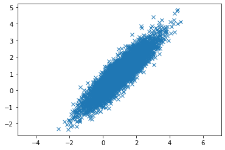

### Data transformation, integration and reduction

It is highly recommended to install [py_stringmatching](https://anhaidgroup.github.io/py_stringmatching/v0.4.x/SimilarityMeasure.html) to compute the similarities for the data integration part. The source code on GitHub could be found [here](https://github.com/anhaidgroup/py_stringmatching). We assume that you work on Google Colab. If you are using a different IDE, then you should by attention to the parts that needs modifications before you write your code. 

For most of the parts, we are going to use the [Pima Indians Diabetes Database](https://www.kaggle.com/datasets/uciml/pima-indians-diabetes-database). We will also use the [preprocessing](https://scikit-learn.org/stable/modules/preprocessing.html) module from sklearn package for performing most of the tasks. 

*The solution assumes that you downloaded the data from Kaggle and uploaded your data to Google Colab. If you are running the code on your own machine, then you should change the location of the data accordingly.*


```python
!pip install py_stringmatching
```

Now, we import the required libraries that will be used to solve the exercises.


```python
import pandas as pd
import numpy as np

from sklearn.preprocessing import StandardScaler as ss
from sklearn.preprocessing import MinMaxScaler as mms
import matplotlib.pyplot as plt
from sklearn.decomposition import PCA
```

### Data transformation (normalization or standardization)

We begin by defining a pandas dataframe that contains some cells with missing values. Note that pandas, in addition to allowing us to create dataframes from a variety of files, also supports explicit declaration.

Read the data into a dataframe. 


```python
df_pid = pd.read_csv('sample_data/diabetes.csv', header = 0,
                 quotechar = '"',sep = ",",
                 na_values = ['na', '-', '.', ''])
df_pid
```

::: callout-note
Normalize the data such that the summation of the values in each attribute (column) is 1.


```python
'''
TODO: normalize the values in each column of the df_pid by dividing the values of each column over
the sum of the values in that column.
'''
```
::: 

::: callout-note
### Min-Max normalization

```python
'''
TODO: write your own code normalize the data in the df_pid by mapping the values to the interval [-5,5]
'''
```


```python
'''
TODO: normalize the data between [-5, 5] using the MinMaxScaler from sklearn
and compare the resulting dataframe with the one from the previous exercise
use df.equals(new_df) to make the comparison.
What do you think about the comparison?
'''
```

:::

::: callout-note
### Z-Score normalization: 
Z-Score is used to standardize the features (columns) by removing the mean and scaling the standard deviation to unit variance.

The standard score of a sample $x$ is calculated as:

$$z = \frac{(x - \mu)}{\sigma}$$

Where $\mu$ is the mean of the values in $x$ and $\sigma$ is the standard deviation. 
The new data should have a mean of 0 and a standard deviation of 1. 

```python
'''
TODO: write your own code to normalize the data in the df by mapping the values of each column
to a set of values with mean = 0 and standard deviation = 1
'''
```


```python
'''
TODO: use the StandardScaler from the sklearn to normalize the data and
compare the results with values that were normaized using your own code.
'''
```
:::


### Data integration
We will use the [py_stringmatching](http://anhaidgroup.github.io/py_stringmatching/v0.4.x/SimilarityMeasure.html) library as it contains implementation of a set of similarity measures. Since we haven't used the GAP similarity before during the lab, we start by simple exercise about using it from the py_stringmatching library.


```python
# After installing the library, you can import the similarity measures
from py_stringmatching import similarity_measure as sm
```

::: callout-note

```python
'''
You have:
s1 = "Advances in Instrumentation and Control"
s2 = "Adv.Instrum.  Control"

TODO: Use affine gap similarity to compare the strings
Use the extend gap cost as 0.1
'''
```

```python
'''
TODO: Modify the affine gap similarity to compare the strings and
divide the score over the length of the short string
'''

```

```python
'''
TODO: given the following records, check if they refer to the same real-world entity
use the following metrics (ignore the pub_id):
 1. Levenshtein similarity for the title (s_t)
 2. Jaro similarity for the authors (s_a)
 3. The modified Affine similarity for the conference (conf) (s_c)
 4. Numerical difference for the year (s_y)
 use the formula rec_sim = 0.5 * s_t + 0.2 * s_a + 0.2 * s_c + 0.1 * s_y
 Report that the records are referring to the same real-world entity if the rec_sim > 0.7
'''
data_columns = ['pub_id', 'title', 'authors', 'conf', 'year']
data1 = [375678,"Adaptable query optimization and evaluation in temporal middleware",\
         "Giedrius Slivinskas, Christian S. Jensen, Richard Thomas Snodgrass",\
         "International Conference on Management of Data",2001]
data2 = ["SlivinskasJS01","Adaptable Query Optimization and Evaluation in Temporal Middleware",\
         "Christian S. Jensen, Richard T. Snodgrass, Giedrius Slivinskas","SIGMOD Conference", 2001]

```
:::


### Data reduction
For the following exercises, we will use the `df_pid` dataframe of the the [Pima Indians Diabetes Database](https://www.kaggle.com/datasets/uciml/pima-indians-diabetes-database). We start by re-reading the dataframe.


```python
df_pid = pd.read_csv('data/diabetes.csv', header = 0,
                 quotechar = '"',sep = ",",
                 na_values = ['na', '-', '.', ''])
df_pid
```

::: callout-note
### Sampling

To select a random subset without replacement, one way is to slice off the first k elements of the array returned by permutation, where k is the desired subset size. Here, we use the 'take' method, which retrieves elements along a given axis at the given indices. Using this function, we slice off the first three elements:


```python
'''
TODO: perform permutation over the index of the dataframe and take the first three records
'''
```

```python
'''
TODO: sample the dataframe to extract three records without replacement
'''
```

```python
'''
TODO: draw three random integer values from the index values of the dataframe 
(Note that the default index of the dataframe starts from 0)
'''
```


OR, you can generate a set of random integer samples of size three.
These random integers can be used as input for the 'take' method, which is then used to sample the data. Since the random integers consituting the array may be repeated, the rows sampled by this method may also be repeated -- or, in other words, sampled with **replacement**.


```python
'''
TODO: generate 3 random integers in the range of the df_pid index and
extract the rows with indexes equal to those integer values.
'''
```

:::


::: callout-note
### Principal component analysis

If you have done a lot of modifications on the df_pid, re-read the dataframe again.


```python
df_pid = pd.read_csv('data/diabetes.csv', header = 0,
                 quotechar = '"',sep = ",",
                 na_values = ['na', '-', '.', ''])
df_pid
```


[PCA](https://scikit-learn.org/stable/modules/generated/sklearn.decomposition.PCA.html) is effected by scale so you need to scale the features in your data before applying PCA. Use StandardScaler to help you standardize the dataset’s features onto unit scale (mean = 0 and variance = 1) which is a requirement for the optimal performance of many machine learning algorithms.

```python
'''
TODO: create a new dataframe X that contains the first 8 columns
(delete the last 'outcome' column).
'''
```

Original data has 8 columns (execluding the outcome column), we would like to project the data into 2 dimensional data


```python
'''
TODO: create a new PCA object and specify the number of PCs to 2.
'''

```

Extract and display the eigenvectors, eigenvalues. Note that we allready eliminated the PCs with small eigenvalues. We only extraced two PCs


```python
'''
TODO: extract the eigenvectors and eigenvalues of the two PCs
STEP
'''
```

We can also start by computing the 8 PCs and discard the ones that are not required later.


```python
'''
TODO: create a new PCA object and specify the number of PCs to 8.
Extract the first two PCs into a dataframe and compare it the dataframe
in the previous step (Hint: use the numpy function `assert_array_almost_equal`).
You should be able to confirm that the dataframes generated in both ways are the same.
'''
```

We can plot the values of the eigenvalues and make sure that the discarded components have eigenvalues smaller than 1.


```python
'''
TODO: plot the eigenvalues as bar plot.
'''

```

We can also plot the projected data on the two components with the eigenvectors in the same plot to see the directions of the eigenvectors. An example code can be found [here](http://bebi103.caltech.edu.s3-website-us-east-1.amazonaws.com/2016/tutorials/aux4_pca.html).


```python
'''
TODO: plot the data of the first two PCs (the PCs with the hieghest eigen values)
together with the eigen vectors on the same plot
'''
```
:::

::: callout-note
### Exercise:
Now, let's apply the same concept on synthetic data from two dimensional normal distribution


```python
mean = [1, 1]
cov = [[1, 0.9], [0.9, 1]]
db = np.random.multivariate_normal(mean, cov, 5000).T
db = db.transpose()
syntheticDF = pd.DataFrame(data = db, columns = ['x', 'y'])
plt.plot(syntheticDF['x'], syntheticDF['y'], 'x')
plt.axis('equal')
plt.show()
```


    


Apply the same steps as we did for the diabetes data but at the end, plot the original data (not the projected data)

**First**, compute the 2 PCs


```python

```

Extract and display the eigenvalues, eigenvectors


```python

```

Plot the original data with the eigenvectors


```python

```
::: 

::: callout-note
### Correlation analysis


```python
'''
TODO: Compute the correlation between every two variables in the data.
Which variables are highly correlated?
'''
```
:::


### Data discretization
We BloodPressure attribute in the `df_pid` dataframe and create histogram to discretize the data.


::: callout-note
```python
'''
TODO: extract the column 'BloodPressure' from the dataframe 'df_pid''
'''
```


```python
'''
TODO: Define an "interface" to matplotlib.axes.Axes.hist() method
and create the histogram of the data
'''
```


```python
'''
TODO: display the parameters of the histogram that summarizes the data
'''
```
:::