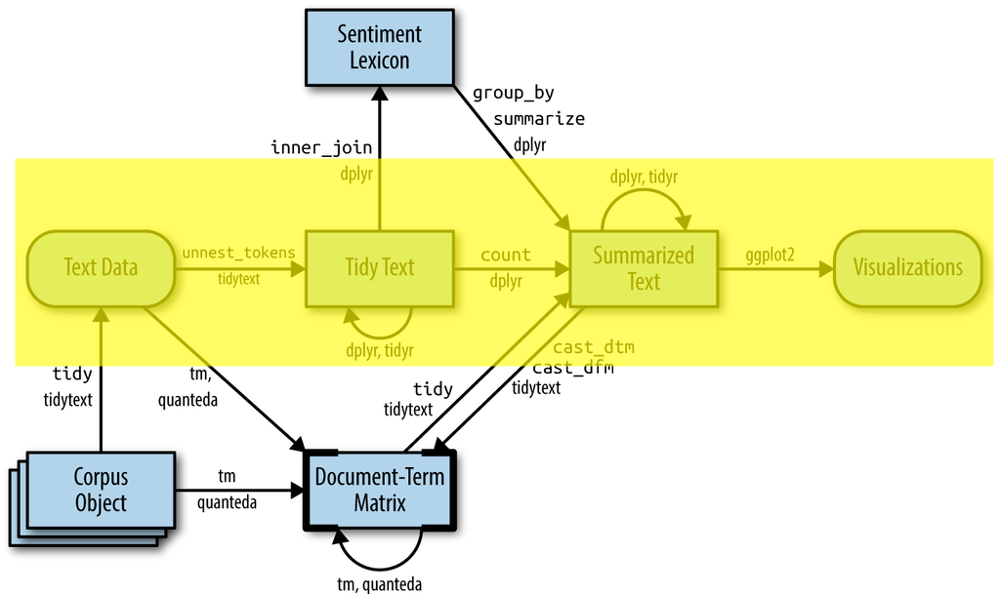

# Introduction

Welcome to the second practical of the week!

The aim of this practical is to introduce you to text pre-processing and regular expressions.

In this practical, you will learn:

 - Visualize the most frequent words in a data set using a word cloud and a bar plot.
 - How to prepare and pre-process your text data.
 - Use regular expressions to retrieve structured information from text.
 
```{r}
#| label: packages
#| warning: false
#| message: false
library(tidyverse) # as always :)
library(tidytext)  # for text mining
library(tm)        # needed for wordcloud
library(wordcloud) # to create pretty word clouds
library(SnowballC) # for Porter's stemming algorithm
```

# Preparation & Pre-process

## Text data set

We are going to use the following data set in this practical.

- **A data set with reviews of computers**.  
This data set is annotated using aspect-based sentiment analysis. Aspect-based sentiment analysis is a text analysis technique that categorizes data by specific aspects and identifies the sentiment attributed to each one. You can download the data as a text file [here](data/computer.txt). The original source is  [here](https://www.cs.uic.edu/~liub/FBS/sentiment-analysis.html).

Each row of the file has the following format: 

```
screen[-1], picture quality[-1] ## When the screen was n't contracting or glitching the overall picture quality was poor to fair .
``` 

The aspects are shown before `##`, the review is shown after `##`.

## Visualization

::: {.callout-tip icon=false}
## 1. Use the `read_delim` function from the `readr` package to read data from the `computer.txt` file into a data frame called `computer_531`.

```{r}
#| label: q1
#| include: !expr params$answers
#| eval: !expr params$answers
computer_531 <- read_delim(
  file = "data/computer.txt", 
  delim = "\n", 
  col_names = "review"
)
head(computer_531)
```
:::

::: {.callout-tip icon=false}

## 2. `wordcloud` is a function from the `wordcloud` package, which plots cool word clouds based on word frequencies in a given data set. Use this function to plot the 50 most frequent words with a minimum frequency of 5 using your data set. wordcloud will directly tokenize your documents.

Check the help file of `wordcloud` function (e.g., `?wordcloud`) to see how to specify the arguments.


```{r}
#| label: q2
#| include: !expr params$answers
#| eval: !expr params$answers
wordcloud(
  words = computer_531$review,
  min.freq = 5,
  max.words = 50,
  random.order = FALSE,
  colors = brewer.pal(8, "Dark2")
)
```

:::

Another way to visualize the term frequencies is using a barplot. For this we need to convert the data to a tidy format (where each word is a different row) and count the number of occurrences of each word. See the diagram below.

{width=70%}

::: {.callout-tip icon=false}
## 3. Use `unnest_tokens` function from `tidytext` package to break the text into individual tokens (a process called [tokenization](https://en.wikipedia.org/wiki/Lexical_analysis#Tokenization)) and use `head` function to see its first several rows.

Hint: `unnest_tokens(data, output column name, input column name)`

```{r}
#| label: q3
#| include: !expr params$answers
#| eval: !expr params$answers
# tokenize texts
comp_words <- computer_531 |> 
  unnest_tokens(word, review)

# check the resulting tokens
head(comp_words)
```
:::


::: {.callout-tip icon=false}
## 4. Use functions from the `dplyr` package (e.g., `count`, `arrange`) to select the most frequent 30 tokens and plot a bar chat using `ggplot`.

```{r}
#| label: q4
#| include: !expr params$answers
#| eval: !expr params$answers
comp_words |> 
  # count the frequency of each word
  count(word) |> 
  # arrange the words by its frequency in descending order
  arrange(desc(n)) |> 
  # select the top 30 most frequent words
  head(30) |> 
  # make a bar plot (reorder words by their frequencies)
  ggplot(aes(x = n, y = reorder(word, n))) + 
  geom_col(fill="gray") +
  labs(x = "frequency", y="words") + 
  theme_minimal()


# Here you see that many of the top words are *stop words*. 
# In the next part of the practical, we will learn how to proceed 
# with pre-processing and remove the stop words!
```
:::

::: {.callout-tip icon=false}
## 5. Remove the stop words from the tokenized data frame and plot a new bar chat.

Hint: Use `anti_join` function to filter the `stop_words` from the `tidytext` package. `stop_words` is a dataset with stop words. By using anti_join, you keep only the words in the first dataset that _are not_ in the `stop_words` dataset. Check the help file if you want further information on either one (e.g., `?anti_join`, `?stop_words`).

```{r}
#| label: q5
#| include: !expr params$answers
#| eval: !expr params$answers
comp_words_no_stop <- 
  comp_words |> 
  # remove stop words
  anti_join(stop_words)

comp_words_no_stop |> 
  # count the frequency of each word
  count(word) |> 
  # arrange the words by its frequency in descending order
  arrange(desc(n)) |> 
  # select the top 30 most frequent words
  head(30) |> 
  # make a bar plot (reorder words by their frequencies)
  ggplot(aes(x = n, y = reorder(word, n))) + 
  geom_col(fill="gray") +
  labs(x = "frequency", y="words") + 
  theme_minimal()
```
:::

::: {.callout-tip icon=false}
## 6. You can always adjust your stopwords list. Create a custom list of stopwords `df_stopwords` by modifying the `stop_words`, adding new words (e.g., 'buy'), and removing some of the current words listed (e.g., 'order'). Then use `df_stopwords` in the `anti_join` function and check the plot.

```{r}
#| label: q6
#| include: !expr params$answers
#| eval: !expr params$answers
# R code here
df_stopwords <- 
  stop_words |> 
  filter(!word %in% c("order", "ordered", "ordering", "orders")) |> 
  rbind(tibble(word = c("buy", "online"), lexicon = c("Me", "Me")))

# remove stop words
comp_words_no_stop_modified <- 
  comp_words |>
  anti_join(df_stopwords)

comp_words_no_stop_modified |> 
  # count the frequency of each word
  count(word) |> 
  # arrange the words by its frequency in descending order
  arrange(desc(n)) |> 
  # select the top 30 most frequent words
  head(30) |> 
  # make a bar plot (reorder words by their frequencies)
  ggplot(aes(x = n, y = reorder(word, n))) + 
  geom_col(fill="gray") +
  labs(x = "frequency", y="words") + 
  theme_minimal()
```
:::

::: {.callout-tip icon=false}
## 7. When we deal with text, often documents contain different versions of one base word, called a stem. SnowballC is a package based on the famous Porter’s stemming algorithm that collapses words into their stem. Use the `getStemLanguages` function to find out how many languages this package supports.

```{r}
#| label: q7
#| include: !expr params$answers
#| eval: !expr params$answers
getStemLanguages()
```
:::

::: {.callout-tip icon=false}
## 8. Applying stemming on your data frame and save the results in a new column. Show the top 30 most frequent stemmed words in a bar plot.


```{r}
#| label: q8
#| include: !expr params$answers
#| eval: !expr params$answers
comp_words_stemming <- 
  comp_words_no_stop_modified |> 
  mutate(stem = wordStem(word))

comp_words_stemming |> 
  # count the frequency of each word
  count(stem) |> 
  # arrange the words by its frequency in descending order
  arrange(desc(n)) |> 
  # select the top 30 most frequent words
  head(30) |> 
  # make a bar plot (reorder words by their frequencies)
  ggplot(aes(x = n, y = reorder(stem, n))) + 
  geom_col(fill="gray") +
  labs(x = "frequency", y="words") + 
  theme_minimal()
```
:::

# Regular expressions
::: {.callout-tip icon=false}
## 9. Use regular expressions (regex) to find the reviews in `computer_531`, which contain words *"Monitor" or "monitor"*, *"memory" or "Memory"*, and *"Delivery" or "delivery"*. See how many reviews contain each pair of words.

Hint: One of many different ways to achieve this is as follows:

1. Use `str_detect` function from `stringr` package to find the presence of patterns of your interest. See the lecture slide if you are unsure how to specify the *regex*. You can try different regex here: https://regexr.com/

2. Use `filter` function to only retain the ones that contain the patterns. You can write in one line such as `filter(str_detect(input vector, regex))`.  

3. Count the number of reviews that contain each pattern.  

```{r}
#| label: q9
#| include: !expr params$answers
#| eval: !expr params$answers
# reviews containing "Monitor" or "monitor"
reviews_mon <- computer_531 |> 
  filter(str_detect(review, "[Mm]onitor"))

# reviews containing "memory" or "Memory"
reviews_mem <- computer_531 |> 
  filter(str_detect(review, "[Mm]emory"))

# reviews containing "Delivery" or "delivery"
reviews_del <- computer_531 |> 
  filter(str_detect(review, "[Dd]elivery"))

# compare the occurrence of each pair of words
kwords    <- c("Monitor", "Memory", "Delivery")
nr_kwords <- c(nrow(reviews_mon), nrow(reviews_mem), nrow(reviews_del))

tibble(kwords, nr_kwords)
```
:::

::: {.callout-tip icon=false}
## 10.  Compare `str_detect`, `str_extract`, `str_subset` and `str_match` functions from the `stringr` package to check which words appear before "monitor" in the reviews from the `computer_531` data set.

What does the regular expression `(\\w+) ([Mm]onitor)` match to? You can explore it using https://regexr.com

```{r}
#| label: q10
#| include: !expr params$answers
#| eval: !expr params$answers
## Detect
head(str_detect(computer_531$review, "(\\w+) ([Mm]onitor)"))

## Extract
head(str_extract(computer_531$review, "(\\w+) ([Mm]onitor)"))

## Subset
head(str_subset(computer_531$review, "(\\w+) ([Mm]onitor)"))

## Match (Useful with capture groups)
head(str_match(computer_531$review, "(\\w+) ([Mm]onitor)"))

# The regular expression `(\\w+) ([Mm]onitor)` matches any word, 
# followed by a space, followed by either Monitor or monitor.
# - str_detect: returns T/F if the match is found or not
# - str_extract: returns the match if it is found (NA otherwise)
# - str_subset: returns the observations for which a match has been found
# - str_match: returns the match (split into groups) and NA otherwise
```
:::

::: {.callout-tip icon=false}
## 11. You can also use `str_extract_all` and `str_match_all` to extract all matches. Use either of these functions to see all of the fully capitalized words in the first 10 reviews.

```{r}
#| label: q11
#| include: !expr params$answers
#| eval: !expr params$answers
# use str_extract_all
str_extract_all(computer_531$review[1:10], '\\b[A-Z]+\\b', simplify = TRUE)
# The output from `str_extract_all`/`str_match_all` is a list, 
# which can be pasted together by using `sapply`. In the case
# of str_extract_all, it can be parsed in different columns 
# using simplify = TRUE.
```
:::

::: {.callout-tip icon=false}
## 12. In order to separate aspects and sentiments in the reviews from the `computer_531` data, let's first use a regular expression to extract the characters at the beginning of each line until `##`. Do this for only the first 20 reviews.

Hint: Use the `str_extract` function such that `str_extract(first 20 reviews, regex)`.

Hint 2: The symbol `^` matches to "start of line". The symbol `.` matches anything. The symbol `*` indicates that the previous character can appear any number of times (including zero times). e.g., `.*` matches to all characters (until the end of the line); `.*R` matches to all characters until a capital R is found.

```{r}
#| label: q12
#| include: !expr params$answers
#| eval: !expr params$answers
str_extract(computer_531[[1]][1:20], "^.*##")
```

:::

::: {.callout-tip icon=false}
## 13. Add a new column to the `computer_531` data frame  with the name `cleaned_review`, which contains only the review text. And add another column with the name `aspect_sentiment`, which contains the aspects and sentiment words (i.e., the ones at the end of each review text).

Hint: Use `mutate()` and `str_extract()` (e.g., `mutate(cleaned_review = str_extract(...), aspect_sentiment = str_extract(...))`).

```{r}
#| label: q13
#| include: !expr params$answers
#| eval: !expr params$answers
computer_531 <- computer_531 |> 
  mutate(cleaned_review = str_extract(review,"##.*$"),
         aspect_sentiment = str_extract(review,"^.*##"))

# check the newly added columns
head(computer_531[-1])

# for an even cleaner version you can use regex's lookbehind and lookahead 
# features to drop the ## parts:
computer_531 <- computer_531 |> 
  mutate(cleaned_review = str_extract(review,"(?<=##).*$"),
         aspect_sentiment = str_extract(review,"^.*(?=##)"))

# check the newly added columns
head(computer_531[-1])
```
:::

::: {.callout-tip icon=false}
## 14. Run the following code below to create a new column `sentiment` with the values `positive`, `negative` and `neutral`. The code assigns `neutral` in case when there is no aspect in the corresponding column or the sum of scores is equal to zero, and it assigns `negative` (`positive`) when the sum score is lower (higher) than zero.

```{r}
#| label: q14
#| include: !expr params$answers
#| eval: !expr params$answers
# define sum_list function which adds the scores
sum_list <- function(list_values) {
  sum(as.numeric(list_values))
}

computer_531 <- computer_531 |>
  # sentiment_score: extract the scores and sum them using the sum_list function
  mutate(sentiment_score = map_dbl(str_extract_all(aspect_sentiment, "[-|\\+]\\d+"), sum_list),
                               # assign negative when score < 0
         sentiment = case_when(sentiment_score < 0 ~ "negative",
                               # assign negative when score > 0
                               sentiment_score > 0 ~ "positive",
                               # assign neutral otherwise
                               TRUE ~ "neutral"))

head(computer_531)
```
:::

::: {.callout-tip icon=false}
## 15. What is the most positive review?

```{r}
#| label: q15
#| include: !expr params$answers
#| eval: !expr params$answers
computer_531 |> 
  arrange(sentiment_score) |>
  tail(1) |>
  pull(cleaned_review)
```
:::
