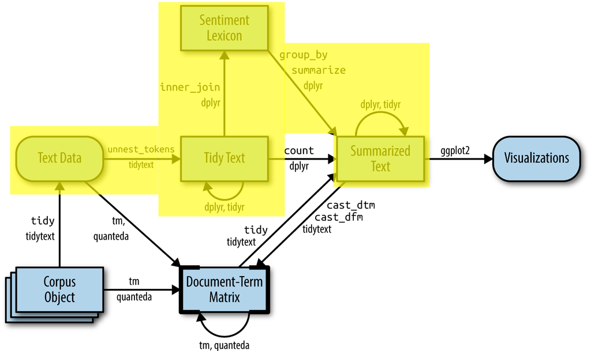
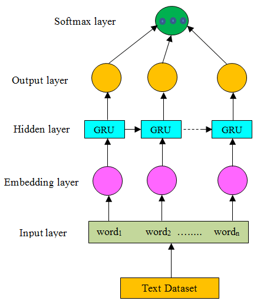

```{r global_options, include=FALSE}
knitr::opts_chunk$set(fig.pos = 'H', include=params$answers, eval=params$answers)
```
  
---

# Introduction

---

Welcome to the third practical of the week!

The aim of this practical is to introduce you to word embedding and sentiment analysis.

The aim of this practical is to introduce you to word embedding, and enhance your understanding of sentiment analysis by learning two different ways of performing sentiment analysis:

 - Dictionary-based methods
 - Optional part: Neural network, using deep learning and word-embeddings

This complements your weekly assignment, where you learn about bag-of-words-based methods.

# Preparation


```{r load_packages, include=TRUE, message=FALSE, warning=FALSE}
library(tidyverse)
library(text2vec) # our dataset comes from this package
library(tidytext) # text transformation
```

# Word embedding

In this part of the practical, we will use word embedding. In order to work with text we need to transform it to numeric values. One way is to count of the words and weight their frequency (e.g. with TF-IDF). An alternative method is word embedding. Word embedding techniques such as word2vec and GloVe use neural networks to construct word vectors. Using these techniques words that are situated in similar contexts are represented with similar numeric vectors. 

Let's start by installing the `harrypotter` package from `github` using [remotes](https://remotes.r-lib.org/):

```{r installharry, eval=FALSE, include=TRUE}
remotes::install_github("bradleyboehmke/harrypotter")
```

The `harrypotter` package supplies the first seven novels in the Harry Potter series. You can install and load this package with the following code:

```{r harrydata, include=TRUE}
library(harrypotter) # Not to be confused with the CRAN palettes package
```

Here is some info about this data set:

- **A data set with all Harry Potter books.**  
This data set contains the full texts of the first seven Harry Potter books (see below the list). Each text is in a character vector with each element representing a single chapter. It is provided from the [harrypotter package](https://github.com/bradleyboehmke/harrypotter) written by [Bradley Boehmke](https://github.com/bradleyboehmke).

  - philosophers_stone: Harry Potter and the Philosophers Stone, published in 1997
  - chamber_of_secrets: Harry Potter and the Chamber of Secrets, published in 1998
  - prisoner_of_azkaban: Harry Potter and the Prisoner of Azkaban, published in 1999
  - goblet_of_fire: Harry Potter and the Goblet of Fire, published in 2000
  - order_of_the_phoenix: Harry Potter and the Order of the Phoenix, published in 2003
  - half_blood_prince: Harry Potter and the Half-Blood Prince, published in 2005
  - deathly_hallows: Harry Potter and the Deathly Hallows, published in 2007


**1. Use the code below to load the first seven novels in the Harry Potter series.**

```{r 1, include=TRUE}
hp_books <- c("philosophers_stone", "chamber_of_secrets",
              "prisoner_of_azkaban", "goblet_of_fire",
              "order_of_the_phoenix", "half_blood_prince",
              "deathly_hallows")

hp_words <- list(
  philosophers_stone,
  chamber_of_secrets,
  prisoner_of_azkaban,
  goblet_of_fire,
  order_of_the_phoenix,
  half_blood_prince,
  deathly_hallows
) %>%
  # name each list element
  set_names(hp_books) %>%
  # convert each book to a data frame and merge into a single data frame
  map_df(as_tibble, .id = "book") %>%
  # convert book to a factor
  mutate(book = factor(book, levels = hp_books)) %>%
  # remove empty chapters
  filter(!is.na(value)) %>%
  # create a chapter id column
  group_by(book) %>%
  mutate(chapter = row_number(book))

head(hp_words)
```

**2. Use the `unnest_tokens` function from the `tidytext` package to tokenize the data frame.**


```{r 2}
# tokenize the data frame
hp_words <- hp_words %>%
  unnest_tokens(word, value)

head(hp_words)
```

**3. Remove the stop words from the tokenized data frame.**

```{r 3}
hp_words <- hp_words %>% 
  # remove stop words
  anti_join(stop_words)

head(hp_words)
```

**4. Creates a vocabulary of unique terms using the `create_vocabulary` function from the `text2vec` package and remove the words that they appear less than 5 times.**
**Hint**: The code is given below, make sure you understand it.  
Step 1. Create a list of words from `hp_words` (iterator object) using `list` function.  
Step 2. Use the `itoken` function on the word list to create index-tokens.  
Step 3: Use the `create_vocabulary` function on the `itoken` object to collect unique terms.   
Step 4: Use the `prune_vocabulary` on the dataframe of unique terms and specify `term_count_min = 5` to filter the infrequent terms.

```{r 4, include = TRUE}
# make it a list (iterator)
hp_words_ls <- list(hp_words$word)
# create index-tokens
it <- itoken(hp_words_ls, progressbar = FALSE) 
# collects unique terms 
hp_vocab <- create_vocabulary(it)
# filters the infrequent terms (number of occurrence is less than 5)
hp_vocab <- prune_vocabulary(hp_vocab, term_count_min = 5)
# show the resulting vocabulary object (formatting it with datatable)
hp_vocab
```


```{r comment1}
# We’ve just created word counts, that’s all the vocabulary object is!
```

**5. The next step is to create a [token co-occurrence matrix](https://stackoverflow.com/questions/24073030/what-are-co-occurence-matrixes-and-how-are-they-used-in-nlp)(TCM). First, we need to apply `vocab_vectorizer` function to transform the list of tokens in to vector space. Then, use `create_tcm` function to create a TCM with the window of 5 for context words.**

**Hint**: The code is given below, make sure you understand it.
Step 1: Map the words to indices by `vocab_vectorizer(vocabulary object from Q14)`.  
Step 2: Create a TCM by `create_tcm(it, vectorizer function from Step 1, skip_grams_window = 5)`. `it` is the
list of iterators over tokens from `itoken`.  
```{r 5, include=TRUE}
# maps words to indices
vectorizer <- vocab_vectorizer(hp_vocab)
# use window of 5 for context words
hp_tcm <- create_tcm(it, vectorizer, skip_grams_window = 5)
```


```{r comment2}
# Note that such a matrix will be extremely sparse. 
# Most words do not go with other words in the grand 
# scheme of things. So when they do, it usually matters.
```

**6. Use the GlobalVectors as given in the code below to fit the word vectors on our data set. Choose the embedding size (rank variable) equal to 50, and the maximum number of co-occurrences equal to 10. Train word vectors in 20 iterations. You can check the full input arguments of the fit_transform function from [here](https://www.rdocumentation.org/packages/text2vec/versions/0.5.1/topics/GlobalVectors).**

```{r 6, include=TRUE}
glove <- GlobalVectors$new(rank = 50, x_max = 10)
hp_wv_main <- glove$fit_transform(hp_tcm, n_iter = 20, convergence_tol = 0.001)
```

**7. The GloVe model learns two sets of word vectors: main and context. Essentially they are the same since the model is symmetric. In general combining the two sets of word vectors leads to higher quality embeddings (read more [here](http://text2vec.org/glove.html)). The best practice is to combine both the main word vectors and the context word vectors into one matrix. Extract the word vectors and save the summation of them for further questions.**

**Hint**: Follow the steps below.  

Step 1. Extract context word vectors by `glove$components`.  
Step 2. Sum two sets of word vectors (e.g., `hv_wv_main + t(hp_wv_context)`).

```{r 19}
# extract context word vector
hp_wv_context <- glove$components

# check the dimension for both matrices
dim(hp_wv_main); dim(hp_wv_context) 

# Either word-vectors matrices could work, but the developers of the technique
# suggest the sum/mean may work better
hp_word_vectors <- hp_wv_main + t(hp_wv_context) # transpose one matrix to perform matrix addition
```

**8. Find the most similar 10 words to each of the words: "harry", "death", and "love".**

**Hint**: Follow the steps below.  

Step 1. Extract the row of the corresponding word from the word vector matrix (e.g., matrix["harry", , drop = FALSE]).  
Step 2. Use `sim2` function with the cosine similarity measure to calculate the pairwise similarities between the chosen row vector (from Step 1) and the rest of words: `sim2(x = whole word vector matrix, y = chosen row vector, method = "cosine", norm = "l2")`.  
Step 3. Sort the resulting column vector of similarities in descending order and present the first 10 values. For example, you can do this by `head(sort(similarity vector, decrasing = TRUE), 10)`.  
Step 4. Repeat *Step 1* - *Step 3*  for the other words. 

```{r 8}
# extract the row of "harry"
harry <- hp_word_vectors["harry", , drop = FALSE]

# calculates pairwise similarities between"harry" and the rest of words
cos_sim_harry <- sim2(x = hp_word_vectors, y = harry, method = "cosine", norm = "l2")

# the top 10 words with the highest similarities
head(sort(cos_sim_harry[,1], decreasing = T), 10)

# extract the row of "death"
death <- hp_word_vectors["death", , drop = FALSE]

# calculates pairwise similarities between"harry" and the rest of words
cos_sim_death <- sim2(x = hp_word_vectors, y = death, method = "cosine", norm = "l2")

# the top 10 words with the highest similarities
head(sort(cos_sim_death[,1], decreasing = T), 10)

# extract the row of "love"
love <- hp_word_vectors["love", , drop = FALSE]

# calculates pairwise similarities between"harry" and the rest of words
cos_sim_love <- sim2(x = hp_word_vectors, y = love, method = "cosine", norm = "l2")

# top 10 words with the highest similarities
head(sort(cos_sim_love[,1], decreasing = T), 10)
```

**9. Now you can play with word vectors! For example, add the word vector of "harry" with the word vector of "love" and subtract them from the word vector of "death". What are the top terms in your result?**

**Hint**: You can literally add/subtract the word vectors to each other (e.g., harry word vector + love word vector - death word vector). Once you have the resulting vector, calculate similarities as you did previously in Question 8.

```{r 9}
# add/subtract word vectors
test <- harry + love - death

# calculates pairwise similarities between"harry" and the rest of words
cos_sim_test <- sim2(x = hp_word_vectors, y = test, method = "cosine", norm = "l2")

# top 10 words with the highest similarities
head(sort(cos_sim_test[,1], decreasing = T), 10)
```

# Dictionary-based Sentiment Analysis
In this part of the practical we are going to apply dictionary-based sentiment analysis methods on the `movie_review` data set.

## Text data

We are going to use the data set `movie_review`. This is a data set with 5,000 IMDB movie reviews available from the `text2vec` package, labeled according to their IMDB rating The sentiment of the reviews is binary, meaning an IMDB rating < 5 results in a sentiment score of 0, and a rating >=7 has a sentiment score of 1. No individual movie has more than 30 reviews.  

The objective of the practical is to understand if the reviews are predictive of the IMDB rating.

Let's load the data set and convert it to a dataframe.

```{r data, include=TRUE}
# load an example dataset from text2vec
data("movie_review")
movie_review <- as_tibble(movie_review)
head(movie_review)
```

## Dictionary-based sentiment analysis

The `tidytext` package contains 4 general purpose lexicons in the sentiments dataset.

 - `afinn`: list of English words rated for valence between -5 and +5
 - `bing`: list of positive and negative sentiment
 - `nrc`: list of English words and their associations with 8 emotions (anger, fear, anticipation, trust, surprise, sadness, joy, and disgust) and 2 sentiments (negative and positive); binary
 - `loughran`: list of sentiment words for accounting and finance by category (Negative, Positive, Uncertainty, Litigious, Strong Modal, Weak Modal, Constraining)

We are going to use labMT dictionary (Dodds' et al. 2011), one of the best dictionaries for sentiment analysis (see e.g. [this paper](https://epjdatascience.springeropen.com/counter/pdf/10.1140/epjds/s13688-017-0121-9.pdf).)
 
 
{width=80%}


**10. Run the code below to download the `labMT` dictionary.**

```{r 10, include=TRUE}
we <- "https://raw.githubusercontent.com/andyreagan/labMT-simple/master/labMTsimple/data/LabMT/data/labMTwords-english.csv"
se <- "https://raw.githubusercontent.com/andyreagan/labMT-simple/master/labMTsimple/data/LabMT/data/labMTscores-english.csv"

labMT <- bind_cols(
  read_csv(we, col_names = "word"),
  read_csv(se, col_names = "value")
)
```


**11. Use `unnest_tokens` function from `tidytext` package to break the `movie_review` data set into individual tokens, then use the `head` function to see its first several rows.**

```{r 11}
# tokenize the reviews
tidy_review <- 
  movie_review %>% 
  unnest_tokens(word, review) 

head(tidy_review)
```

**12. Remove the stop words from the tokenized data frame.**
**Hint**: Use `anti_join` function to filter the `stop_words` from the `tidytext` package. 

```{r 12}
tidy_review <- tidy_review %>% 
  # remove stop words
  anti_join(stop_words)

head(tidy_review)
```


**13. Use the `inner_join` function to find a sentiment score for each of the tokenized review words using the labMT dictionary.**

```{r 13}
review_sentiment <- 
  tidy_review %>%
  inner_join(labMT)

head(review_sentiment)
```

**14. Calculate the average sentiment score for each review. What are the three most positive and negative reviews (i.e., has the highest and lowest average sentiment score)? Save the results with the name `sorted_review_sentiment`**

**Hint**: Follow the steps below.    
Step 1. Group the data by `id` using `group_by` function.  
Step 2. Use `summarize` function to compute (1) the average sentiment score (mean(value)) (2) the average sentiment from the original review (mean(sentiment)).   
Step 3. Use `arrange` function to sort the average sentiment score in descending order. Or, you can use `slice_max` function to select the rows with the highest sentiment score.

```{r 14}
sorted_review_sentiment <- 
  review_sentiment %>%
  # group by review id
  group_by(id) %>% 
  # compute the average sentiment score
  summarize(average_sentiment = mean(value),
            sentiment = mean(sentiment)) %>% 
  # arrange the average sentiment score in descending order
  arrange(desc(average_sentiment)) 

sorted_review_sentiment
```

Step 4. Use the IDs of the reviews with the highest and lowest average sentiments to filter the `movie_review` dataset and see if your results make sense.


```{r}
# filter happiest reviews
movie_review %>% 
  filter(id %in% head(sorted_review_sentiment$id, 3)) %>% 
  pull(review)
```

```{r}
# filter saddest reviews
movie_review %>% 
  filter(id %in% tail(sorted_review_sentiment$id, 3)) %>% 
  pull(review)
```


**15. Plot a bar chart of these average sentiment scores across the `id`s. Use color to show the original sentiment**

**Hint**: Use the `sorted_review_sentiment` dataset. Map `id` onto y-axis and average sentiment scores onto x-axis.

```{r 15}
sorted_review_sentiment %>%
  # create the coloring variable
  mutate(sentiment = ifelse(sentiment > 0, "pos", "neg")) %>%
  # reorder `id` such that average sentiment scores are presented in descending order. 
  ggplot(aes(
    x = reorder(id, -average_sentiment), 
    y = average_sentiment - mean(average_sentiment), 
    fill = sentiment
  )) +
  # plot the bar chart using `geom_col`
  geom_col() + 
  labs(x = "id", title = "Average sentiment scores") +
  theme_minimal() + 
  theme(axis.text.x=element_blank()) 
```

16. **Create a `predicted_sentiment` column, such that_average score higher than 5.75 is positive = 1 and average score lower than or equal to 5.75 is negative = 0. Then, use a [confusion matrix](https://en.wikipedia.org/wiki/Confusion_matrix) to compare this `predicted_sentiment` to the original sentiment. What is the accuracy of our results?**

**Hint**: You can use `ifelse` function to create `predicted_sentiment` (i.e., dichotomize the average sentiment score). Then, use `table` function to create the confusion matrix.  
Note that there are some rows removed when we `inner_join` the reviews with labMT lexicon. You need to filter out those removed rows before comparing the predicted sentiment to original sentiment.

```{r 16}
review_sentiment_agg <- 
  sorted_review_sentiment %>%
  # Dichotomize average sentiment score to match with the original sentiment scores
  # 1: scores higher than zero; 0: scores lower than or equal to zero
  mutate(predicted_sentiment = ifelse(average_sentiment > 5.75, 1, 0),)

## not too bad
table(
  true = review_sentiment_agg$sentiment, 
  predicted = review_sentiment_agg$predicted_sentiment
)
```

```{r acccomment}
# Accuracy = 1653+1729/5000 = 67.64%
```

**17. Follow the same steps, but only for the reviews in the top or bottom 25% of the distribution of average sentiment (there are likely many neutral reviews). Do our results improve? What is the accuracy of our results?**

```{r 17}
summary(sorted_review_sentiment$average_sentiment)

review_sentiment_agg <- sorted_review_sentiment %>%
  filter((average_sentiment > 5.945) | (average_sentiment < 5.528)) %>% 
  # Dichotomize average sentiment score to match with the original sentiment scores
  # 1: scores higher than zero; 0: scores lower than or equal to zero
  mutate(predicted_sentiment = ifelse(average_sentiment > 5.75, 1, 0),)

## not too bad
table(
  true = review_sentiment_agg$sentiment, 
  predicted = review_sentiment_agg$predicted_sentiment
)
```

```{r acccomment2}
# Accuracy = (935+990)/2501 = 77.0%
# Our accuracy increases considerably
```

---

# OPTIONAL: Neural Networks

In this part of practical, we will show an example of using neural networks for text classification. 
As our embedding layer (which transforms the words into numeric vector), we will use GloVe word embeddings. An alternative to this would be to train this layer ourselves. 


{width=50%}


Besides the packages loaded above, we need to install the `TensorFlow` and `Keras` packages for R.

The `TensorFlow` package provides code completion and inline help for the [TensorFlow API](https://www.tensorflow.org/api_docs/python/tf/all_symbols) when running within the RStudio IDE. The `TensorFlow` API is composed of a set of Python modules that enable constructing and executing `TensorFlow` graphs.

Install the `TensorFlow` R package from GitHub as follows:

```{r, include=TRUE, eval=FALSE}
remotes::install_github("rstudio/tensorflow")
```

Then, we can load `tensorflow` as follows:

```{r tensload}
library(tensorflow)
```

But we still need to use the `install_tensorflow` function to install `TensorFlow` (warning, this may take time / be a bit buggy):

```{r, include=TRUE, eval=FALSE}
install_tensorflow()
```

Finally, you can confirm that the installation succeeded with:

```{r, include=TRUE}
tmr <- tf$constant("Text Mining with R!")
print(tmr)
```

This will provide you with a default installation of `TensorFlow` suitable for getting started with the TensorFlow R package. See the article on installation (https://tensorflow.rstudio.com/installation/) to learn about more advanced options, including installing a version of `TensorFlow` that takes advantage of Nvidia GPUs if you have the correct CUDA libraries installed.

To install the Keras package you first run either of the following lines:
```{r, include=TRUE}
# install.packages("keras")
# remotes::install_github("rstudio/keras")
```

Then, use the `install_keras()` function to install Keras. The `Keras` R interface uses the `TensorFlow` backend engine by default. This will provide you with default CPU-based installations of `Keras` and TensorFlow. If you want a more customized installation, e.g. if you want to take advantage of NVIDIA GPUs, see the documentation for `install_keras()` and the article on installation (https://tensorflow.rstudio.com/installation/).

The ISLR authors also prepared an installation guide to Python, Reticulate and Keras:
https://web.stanford.edu/~hastie/ISLR2/keras-instructions.html

## Sentiment classification with pre-trained word vectors

Now we have `TensorFlow` and `Keras` ready for fine-tuning pre-trained word embeddings for sentiment classification on movie reviews.

Remember to load the `Keras` library : 
```{r, include=TRUE}
library(keras)
```

For sentiment classification with pre-trained word vectors, we want to use [GloVe](https://nlp.stanford.edu/projects/glove/) pretrained word vectors. These word vectors were trained on Wikipedia 2014 and Gigaword 5 containing 6B tokens, 400K vocab, uncased, 50d, 100d, 200d, & 300d vectors. We have provided the `glove.6B.50d.txt` file in the data folder. 

**O1. Use the code below to load the pre-trained word vectors from the file 'glove.6B.300d.txt'**

```{r O3, include = TRUE}
# load glove vectors
vectors <- read_delim("data/glove.6B.50d.txt", delim = "_", col_names = c("word", paste0("dim_", 1:50)))
head(vectors)
```

**O2. To create a learning model using `Keras`, let's first define the hyperparameters. Define the parameters of your `Keras` model with a maximum of 10000 words, maxlen of 60 and word embedding size of 300.**

```{r O4, include=TRUE}
max_words <- 1e4  # maximum vocabulary size
maxlen    <- 60   # maximum number of tokens in a text
dim_size  <- 50   # embedding size
```


**O3. Use the `text_tokenizer` function from `Keras` and tokenize the movie review data (i.e., `movie_review`) using a maximum of 10000 words. And fit the created object using the `fit_text_tokenizer` function.**
**Hint**: `text_tokenizer(num_words = ...) %>% fit_text_tokenizer(vector_wtih_texts)` 
```{r O5}
# tokenize the input data and then fit the created object
word_seqs <- text_tokenizer(num_words = max_words) %>%
  fit_text_tokenizer(movie_review$review)
```


**O4. Transform each text into a sequence of integers (word indices) using `texts_to_sequences` and use the `pad_sequences` function to pad the sequences.**
**Hint**: `texts_to_sequences(the tokenizer you created above in Q10, review column) %>% pad_sequences(maxlen = ...)`
```{r O6}
# apply tokenizer to the text and get indices instead of words
# later pad the sequence
x_train <- texts_to_sequences(word_seqs, movie_review$review) %>%
  pad_sequences(maxlen = maxlen)
```


**O5. What are the dimensions of `x_train`? What do they represent?**

```{r}
dim(x_train)
```

```{comment}
x_trains contains the indices of the first 60 tokens of each review
```

**O6. Use the code below to convert the sequence into a dataframe. What does `dic` represent?**

```{r O8, include=TRUE}
# unlist word indices
word_indices <- unlist(word_seqs$word_index)

# then place them into data.frame
dic <- data.frame(word = names(word_indices), key = word_indices, stringsAsFactors = FALSE) %>%
  arrange(key) %>% .[1:max_words,]

head(dic)
```

```{comment}
dic contains the index of each word
```


**O7. Use the code below to join the dataframe of sequences (word indices) from the IMDB reviews with GloVe pre-trained word vectors.**

```{r O9, include = TRUE}
# join the words with GloVe vectors and
# if a word does not exist in GloVe, then fill NA's with 0
word_embeds <- dic  %>%
  left_join(vectors) %>%   # merge vectors with embeddings
  select(!(word|key)) %>%  # remove first two columns with key and index
  replace(., is.na(.), 0) %>% 
  as.matrix()
```

**O8. Extract the outcome variable from the `sentiment` column in the original dataframe and name it `y_train.`**

```{r O10}
# the outcome variable
y_train <- as.matrix(movie_review$sentiment)
```


**O9. Use the `Keras` functional API and create a neural network model as below. Can you describe this model? What is the meaning the trainable = FALSE?**

```{r O11, include = TRUE}
# Use Keras Functional API
input <- layer_input(shape = list(maxlen), name = "input")

output <- input %>%
  layer_embedding(input_dim = max_words, output_dim = dim_size, input_length = maxlen,
                  weights = list(word_embeds), trainable = FALSE) %>%
  layer_dense(units = 60, activation = "relu")                    %>%  
  layer_flatten()                                                 %>%                                      
  layer_dense(units = 1, activation = "sigmoid")

model <- keras_model(input, output)

summary(model)
```


**O10. We can compile the model with an `'adam'` optimizer, and the `binary_crossentropy` loss. You can also choose `accuracy` or `AUC` for the metrics as shown below.**

```{r O12, include=TRUE}
# instead of accuracy we can use "AUC" metrics from "tensorflow.keras"
model %>% compile(
  optimizer = "adam", # optimizer = optimizer_rmsprop(),
  loss = "binary_crossentropy",
  metrics = c('accuracy', tensorflow::tf$keras$metrics$AUC() )  
)
```

**O11. Fit the model with 50 epochs (iterations), batch_size = 32, and validation_split = 0.2. Check the training performance versus the validation performance.**
**Hint**: You can use `model %>% keras_fit(x_train, y_train,epochs = ..., batch_size = ..., validation_split = ...)`.  Then, plot the resulting object using `plot` function.

```{r O13}
history <- model %>% keras::fit(
  x_train, y_train,
  epochs = 10,
  batch_size = 32,
  validation_split = 0.2
)

plot(history)
```

**O12. See the network model below. Compare the results of the two and to try to think of ways to further improve the accuracy.**

```{r O14, include=TRUE}
input <- layer_input(shape = list(maxlen), name = "input")

model <- input %>%
  layer_embedding(input_dim = max_words, output_dim = dim_size, input_length = maxlen,
                  # put weights into list and do not allow training
                  weights = list(word_embeds), trainable = FALSE) %>%
  layer_spatial_dropout_1d(rate = 0.2) %>%
  bidirectional(
    layer_gru(units = 80, return_sequences = TRUE)
  )
max_pool <- model %>% layer_global_max_pooling_1d()
ave_pool <- model %>% layer_global_average_pooling_1d()

output <- layer_concatenate(list(ave_pool, max_pool)) %>%
  layer_dense(units = 1, activation = "sigmoid")

model <- keras_model(input, output)

# model summary
model

```


```{r}
# instead of accuracy we can use "AUC" metrics from "tensorflow.keras"
model %>% compile(
  optimizer = "adam", # optimizer = optimizer_rmsprop(),
  loss = "binary_crossentropy",
  metrics =  c('accuracy', tensorflow::tf$keras$metrics$AUC() )  
)

history <- model %>% keras::fit(
  x_train, y_train,
  epochs = 10,
  batch_size = 32,
  validation_split = 0.2
)

plot(history)
```

### Conclusions about the results

We can see that it is not trivial to get a high performance using neural networks. Even our tuned model was only able to slightly increase the accuracy of our results (75% vs 67% for the dictionary model). Our first model completely failed, with an accuracy of ~60%.

Part of the reason why neural networks perform relatively poorly is the nature of the problem. It is inherently hard to predict the IMDB rating of a movie based on individual reviews. A second reason is the relatively low amount of data. The impressive performance of some text models (test one yourself [here](https://6b.eleuther.ai/)) requires billions of texts for training.

An advantage of dictionary methods is their tractability. We can understand what makes texts positive or negative (see e.g. this tool: https://comparetext-stage.herokuapp.com/). This is not the case with neural networks, although the field of interpretable AI is improving fast.
