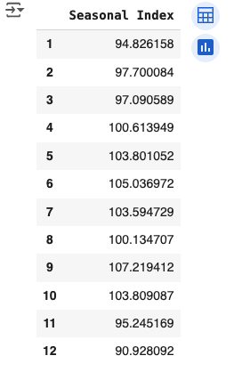

```python
import numpy as np
import pandas as pd
import matplotlib.pylab as plt
from sklearn import linear_model
from sklearn.linear_model import LinearRegression
from sklearn import metrics
import pylab as pl
import math
```

For the exercises in this lab, we will use the [oil price](https://www.kaggle.com/c/store-sales-time-series-forecasting/data) dataset from Kaggle.
We will consider that you are using Google Colab so upload your data files to the directory sample_data.


## Upload and explore the data 

::: callout-note
##### Read the data
```python
df_oil = pd.read_csv('sample_data/oil.csv', header = 0,
                 quotechar='"',sep=",",
                 na_values = ['na', '-', '.', ''], low_memory=False)
```

#### Explore the data
We take a look at the data by plotting the whole data


```python
# Use scatter plot to plot the 'Oil Price' against the 'Date'
plt.rcParams.update({'font.size': 16})
fig, ax = plt.subplots()
# Plot the data as scatter plot
start = 0
limit = len(df_oil)
end = start + limit - 1
ax.plot(df_oil.date[start:end], df_oil.dcoilwtico[start:end], '-')
# Changing the labels on the x-axis
x = [df_oil.date.iloc[start], df_oil.date.iloc[start + math.floor(limit / 4)], \
     df_oil.date.iloc[start + math.floor(limit / 2)], df_oil.date.iloc[start + math.floor(3 * limit / 4)], \
     df_oil.date.iloc[end]]
ax.set_xticks(x)
plt.xticks(rotation = 45)
# put the label for the x-axis 'Date' and for the y-axis 'Oil Price'
ax.set(xlabel='Date', ylabel='Oil Price')

```

#### Look at the details
We cannot see a lot of details, let's consider a smaller period


```python
plt.rcParams.update({'font.size': 16})
fig, ax = plt.subplots()
'''
TODO: Plot only 300 points starting from the point at index 300
'''
```
::: 


## Depicting the trend of the Oil Price

A trend exists when there is a long-term increase or decrease in the data. It does not have to be linear. Researchers also refer to a trend as “changing direction”, when it might go from an increasing trend to a decreasing trend and vice versa.

::: callout-note

1- Using **semi-average**

```python
'''
TODO: use the semi-average technique from the slides to summarize the time series trend
'''
```

2- Using **moving-average**

Use the [rolling](https://pandas.pydata.org/docs/reference/api/pandas.DataFrame.rolling.html) API for depicting the trend using the moving average method.

First: use rolling(window = 50)

Second: use rolling(window = 50, min_periods = 1)

Comment on the differences 

```python
ma_win_size = 50
df_oil_ma = df_oil.copy()
'''
TODO: use pd.DataFrame.rolling(window = ma_win_size), comment on the output
'''
```

```python
ma_win_size = 50
'''
TODO: use pd.DataFrame.rolling(window = ma_win_size, min_periods = 1), comment on the output
'''
```

There is a problem because of the missing values. Check the documentation for **min_periods**.

**Optional:** It might be useful sometime to show part of the data next to the figure, we can do that as follows:

```python
# Display part of the data next to figure
df_oil_new = df_oil_ma
start = ma_win_size
limit = len(df_oil_new) - ma_win_size - 1
end = start + limit

fig, ax = plt.subplots()
'''
TODO: Plot the trend of the data that was generated using 
moving average technique in the previous cell
'''

''''
Now, we plot a snippet of the data next to the figure 
(Optional just to give you a way to plot part of the data)
'''
a = df_oil_new.date[start:start + 10]
b = [round(num, 2) for num in df_oil_new.dcoilwtico[start:start + 10]]
data = [list(a), list(b)]
numpy_array = np.array(data)
data = numpy_array.T.tolist()
tbl = plt.table(cellText = data,
          colLabels=['Date', 'Oil Price'],
          loc='left',
          bbox=[-0.7, 0, 0.5, 1])

ax.set(xlabel='Date', ylabel='Oil Price')

```

3- Using **Linear Regression**

We will start by testing the method of computing the coefficients of the linear regression as discussed in the lecture and compare the found coefficients with the coefficients that are computed using the built-in functions. 

```python
'''
Our function for computing the linear regression coefficients.
This function accepts only one dimensional data
'''
def mySimpleLinearRegression(x, y):   
    x_mean = np.mean(x)
    y_mean = np.mean(y)

    x_diff = x - x_mean
    y_diff = y - y_mean

    coef = sum(x_diff * y_diff) / sum(x_diff ** 2)
    intercept = y_mean - coef * x_mean
    return (intercept , coef)
```


```python
'''
Preprocess the dataframe by removing the missing values and re-indexing the data
'''
df_oil_nona = df_oil.dropna()
df_oil_nona.reset_index(drop=True, inplace=True)
offset = math.floor(len(df_oil_nona) / 2)
df_oil_nona['x'] = df_oil_nona.index - offset
'''
TODO: use the function in the previous cell to compute the linear regression coefficients.
'''

print('Using the formula from the slides: ')
print('intercept = ', a0, '\nCoef. = ', a1)
'''
TODO: use the scikit learn LinearRegression class to compute the linear regression coefficients.
'''


print('\n\nUsing the scikit learn package:')
print( "Intercept:", myLR.intercept_[0])
print( "Coef.:", myLR.coef_[0][0])

'''
TODO: now Plot the data and the line that is generated by linear regression 
'''
start = 0
limit = len(df_oil_nona) - 1
end = start + limit
```

4- Using **Exponential Smoothing**


```python
df_oil_nona = df_oil.dropna()
df_oil_nona.reset_index(drop=True, inplace=True)

alpha = 0.5
'''
TODO: Apply the exponential Smoothing on the data and display the resulting time series
use different values for alpha and comment on the results
'''

```


```python
df_oil_nona = df_oil.dropna()
df_oil_nona.reset_index(drop=True, inplace=True)

alpha = 0.001

# TODO: repeat the same smoothing as in the previous cell but with alpha = 0.001
# Comment on the results
```
::: 


## Seasonal Component

A seasonal pattern occurs when a time series is affected by seasonal factors such as the time of the year or the day of the week. Seasonality is always of a fixed and known frequency. 

Using the oil data and groupby, find the seasonal index per month. You can start by computing the average oil price per month over the different years and then compute the average of averages to get the seasonal index per month. 
Your output should look like:



**Note:** the values of the Seasonal Index may change slightly due to the used technique for handling the missing values.


## Time series decomposition

There are three types of time series patterns: trend, seasonality and cycles. When decomposing a time series into components, we usually combine the trend and cycle into a single trend-cycle component (sometimes called the trend for simplicity). Thus, we think of a time series as comprising three components: a trend-cycle (or trend) component, a seasonal component, and a remainder component (containing anything else in the time series).

During the lecture, you learned about different techniques ('Additive', 'Multiplicative' and 'STL') for decomposing time series. Now, you need to apply them on the oil dataset and comment on your findings. 

You may look at this [Website](https://www.statsmodels.org/dev/examples/notebooks/generated/stl_decomposition.html) for more information

::: callout-note

```python
'''
TODO: Apply the Additive time series decomposition on the oil dataset. 
'''
```


```python
'''
TODO: Apply the Multiplicative time series decomposition on the oil dataset. 
'''
```


```python
'''
TODO: Apply the STL time series decomposition on the oil dataset. 
'''
```
::: 

## Demand Forecasting

We will also use the oil dataset. We will remove the values of the last two weeks from the data and use it to check the different forecasting models. We will test forecasting using moving average, linear regression, ARIMA and Exponential Smoothing from the STL package. 

We will start by reading the data and splitting it into train and test (the test will contain the readings of the last two week in the time series). 

::: callout-note

```python
# Let's read the data again
df_oil_FC = pd.read_csv('sample_data/oil.csv', header = 0,
                 quotechar='"',sep=",",
                 na_values = ['na', '-', '.', ''], low_memory=False)
```

remove the last two weeks of the data and store it as test data


```python
'''
TODO: store the last two weeks ofthe data in a test dataframe
the data from all the weeks except the last two weeks in a dataframe train
'''
```

### Perform demand forecasting using moving average


```python
k = 5
'''
TODO: predict the values of the last two weeks using the moving average with k = 5
'''
```


```python
'''
Display the original values
'''
test.dcoilwtico
```


```python
'''
TODO: measure the performance of your predictor by computing the MSE between 
the predicted and the actual values
'''
MSE = np.mean((new_list[-t:] - test.dcoilwtico)**2)
MSE
```

### Perform demand forecasting using Linear Regression


```python
'''
TODO: predict the values of the last two weeks using the Linear Regression
'''
```


```python
'''
TODO: measure the performance of your predictor by computing the MSE 
between the predicted and the actual values
'''
MSE = 
MSE
```


```python
'''
TODO: predict the values of the last two weeks using the Linear Regression 
but use the last n data points (n of your choice)
'''
```


```python
''''
TODO: measure the performance of your predictor by computing the MSE 
between the predicted and the actual values
'''
MSE = 
MSE
```

### Perform demand forecasting using STL forecasting


```python
'''
TODO: Use the ARIMA and exponential_smoothing from STL package for forecasting the oil prices for the last two weeks. 
Check the website https://www.statsmodels.org/dev/examples/notebooks/generated/stl_decomposition.html 
'''
```

```python
''''
TODO: measure the performance of your predictor by computing the MSE 
between the predicted and the actual values
'''
MSE_ARIMA = 
MSE_ES = 
print(MSE_ARIMA, MSE_ES)
```

:::
