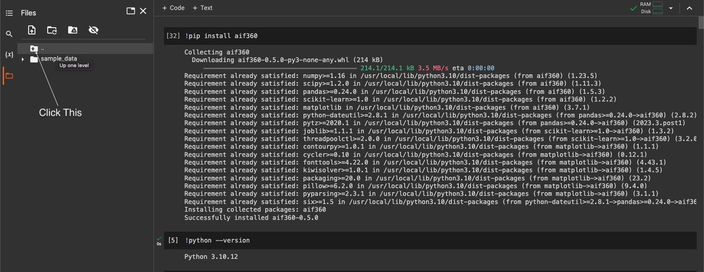

```python
import numpy as np
import pandas as pd
from collections import Counter
from sklearn.datasets import make_classification
from sklearn.model_selection import train_test_split
from imblearn.over_sampling import SMOTE
from matplotlib import pyplot as plt
from numpy import where
from sklearn.linear_model import LogisticRegression
from sklearn.ensemble import RandomForestClassifier
from sklearn.metrics import confusion_matrix
from sklearn.metrics import accuracy_score
from sklearn.metrics import balanced_accuracy_score
from sklearn.metrics import f1_score
from sklearn.preprocessing import StandardScaler
```

# Handling the Imbalanced Data Problem

We will start by generating 2-D imbalanced data from two classes (9900 from class 0 and 100 from class 1).


```python
X_org, y_org = make_classification(n_samples=10000, n_features=2, n_redundant=0,
	n_clusters_per_class=1, weights=[0.99], flip_y=0, random_state=1)
# summarize class distribution
counter = Counter(y_org)
print("Before Running SMOTE: ", counter)
for label, _ in counter.items():
	row_ix = where(y_org == label)[0]
	plt.scatter(X_org[row_ix, 0], X_org[row_ix, 1], label=str(label))
plt.legend()
plt.show()
```
We will split the data into training and testing set with 70/30 ratio. We will train a logistic regression model on the training data and evaluate its performance on the test data using three performance measures `F1-Score, Accuracy, Balanced Accuracy`.

```python
X_train, X_test, y_train, y_test = train_test_split(X_org, y_org, test_size = 0.30,
                                                    shuffle = True,
                                                    stratify = y_org)
# Plot the training
counter = Counter(y_train)
print("In training: ", counter)
for label, _ in counter.items():
	row_ix = where(y_train == label)[0]
	plt.scatter(X_train[row_ix, 0], X_train[row_ix, 1], label=str(label))
plt.legend()
plt.show()

# Plot the testing set

counter = Counter(y_test)
for label, _ in counter.items():
	row_ix = where(y_test == label)[0]
	plt.scatter(X_test[row_ix, 0], X_test[row_ix, 1], label=str(label))
plt.legend()
plt.show()

len(X_train), len(X_test)

```


```python
# Train a logisitic regression model
# Train the model with the training subset
logreg = LogisticRegression()
logreg.fit(X_train, y_train)

# Test the model on the test subset
result = logreg.predict(X_test)
# Display the confusion matrix to check the performance of your model
confusion_matrix(result, y_test)
```


```python
f1 = f1_score(y_test, result, average=None)
acc = accuracy_score(y_test, result, normalize=True)
bacc = balanced_accuracy_score(y_test, result)
print ("F1-Score = {}\nAccuracy = {}\nBalanced Accuracy = {}".format(f1, acc, bacc))
```


To solve the imbalanced data problem, we will practice on two techniques:

* Generating more examples from the class of minority.
* Using cost sensitive classification.


## Synthetic Data Generation
We start with generating synthetic data from the minority using `SMOTE` and `GANs`.

::: callout-note
### SMOTE for Balancing Data

The first technique that we will use is [SMOTE](https://imbalanced-learn.org/stable/references/generated/imblearn.over_sampling.SMOTE.html). Make sure that you use only the training set to generate more examples. 


```python
# transform the dataset
oversample = SMOTE()
X_OS, y_OS = oversample.fit_resample(X_train, y_train)
# summarize the new class distribution
counter = Counter(y_OS)
print("After Running SMOTE", counter)
# scatter plot of examples by class label
for label, _ in counter.items():
	row_ix = where(y_OS == label)[0]
	plt.scatter(X_OS[row_ix, 0], X_OS[row_ix, 1], label=str(label))
plt.legend()
plt.show()
```


```python
# Train a logisitic regression model
# Train the model with the training subset
logreg = LogisticRegression()
logreg.fit(X_OS, y_OS)

# Test the model on the test subset
result = logreg.predict(X_test)
# Display the confusion matrix to check the performance of your model
confusion_matrix(result, y_test)
```


```python
f1 = f1_score(y_test, result, average=None)
acc = accuracy_score(y_test, result, normalize=True)
bacc = balanced_accuracy_score(y_test, result)
print ("F1-Score = {}\nAccuracy = {}\nBalanced Accuracy = {}".format(f1, acc, bacc))
```

The classifier tend to classify more examples as negative than before so it is predicting more samples from the minority class. **Keep this in mind so you can apply it for the fairness**

**Note That:** SMOTE treats all the variables as numerical values from a continuous random variable. If you have categorical data, then you can use SMOTENC for mixed set of features (continuous, categorical) from the imblearn.over_sampling package.

::: 

::: callout-note

### C-GAN: Generate Synthetic Data

CTGAN model is conditional generative network based on Deep Learning data synthesizing.
The architecture is comprised of a generator and a discriminator model. The generator is responsible for generating new examples that, ideally, are indistinguishable from real examples in the dataset. The discriminator model is responsible for classifying a given example as either real (drawn from the dataset) or fake (generated).

The models are trained together in a zero-sum manner, such that improvements in the discriminator come at the cost of a reduced capability of the generator, and vice versa.

First, we will join the data values with their labels to be used by the GAN as training data.

You may need to install the sdv and ctgan packages using:

* !pip install sdv
* !pip install ctgan

If you are facing problems, you can check the documentation of ctgan [here](https://docs.sdv.dev/sdv/). We will point to specific parts of the documentation later. 


```python
b = np.array([y_train])
data = np.concatenate((X_train, b.T), axis=1)
df = pd.DataFrame(data, columns=['x1', 'x2', 'y'])
```

You need to extract the metadata of the dataframe to define the synthesizer. Check [metadata](https://docs.sdv.dev/sdv/single-table-data/data-preparation/single-table-metadata-api) for more information.


```python
from ctgan import CTGAN
from sdv.metadata import SingleTableMetadata

metadata = SingleTableMetadata()
metadata.detect_from_dataframe(data=df)
```

We can display the collected information about the dataframe using:


```python
python_dict = metadata.to_dict()
python_dict
```

Define a `CTGANSynthesizer` and pass the collected metadata to the defined object. Check this [link](https://docs.sdv.dev/sdv/single-table-data/modeling/synthesizers/ctgansynthesizer) for more information. 


```python
from sdv.single_table import CTGANSynthesizer

synthesizer = CTGANSynthesizer(metadata)
synthesizer.fit(df)
```

List the constraints that would you like to apply in order to generate values with specific characteristics. Here, we need to generate examples from the minority class `y = 1`. You need also to find how many examples you want to generate to have balanced dataset. For more information check this [link](https://docs.sdv.dev/sdv/single-table-data/sampling/conditional-sampling).


```python
from sdv.sampling import Condition
counter = Counter(y_train)
needed_rows = counter[0] - counter[1]
cond = Condition(
    num_rows = needed_rows,
    column_values={'y': 1}
)
print(cond, needed_rows)
```

Use the `synthesizer` to generate the required set of examples according to the conitions that you specfied in the previous step. Concatenate the generated examples with the examples from the original dataframe.  


```python
synthetic_data = synthesizer.sample_from_conditions(
    conditions=[cond],
    output_file_path = None
)
df_OS = pd.concat([df, synthetic_data])
df_OS.y.value_counts()
```

You can plot the new dataframe to check the generated data. 


```python
y_array = df_OS.y
counter = Counter(y_array)
print("After producing more examples from the minority class: ", counter)
X_array = np.array(df_OS.loc[:, df_OS.columns != 'y'])
for label, _ in counter.items():
	row_ix = where(y_array == label)[0]
	plt.scatter(X_array[row_ix, 0], X_array[row_ix, 1], label=str(label))
plt.legend()
plt.show()
```

Train a logistic regression model as you did before and check the performance of the model in terms of F1-Score, Accuracy and Balanced Accuracy. Comment on the results. 


```python
'''
TODO: Train a logistic regression model
Train the model with the training subset
'''
X_train_GAN = df_OS.loc[:, df_OS.columns != 'y']
y_train_GAN = df_OS.loc[:, df_OS.columns == 'y']
logreg = LogisticRegression()
logreg.fit(X_train_GAN, y_train_GAN)

# TODO: Test the model on the test subset
result_GAN = logreg.predict(X_test)
# TODO: Display the confusion matrix to check the performance of your model
confusion_matrix(result_GAN, y_test)
```


```python
f1 = f1_score(y_test, result_GAN, average=None)
acc = accuracy_score(y_test, result_GAN, normalize=True)
bacc = balanced_accuracy_score(y_test, result_GAN)
print ("F1-Score = {}\nAccuracy = {}\nBalanced Accuracy = {}".format(f1, acc, bacc))
```

::: 


## Cost sensitive classification

Specifying the cost of misclassification is another technique for forcing the classifiers to predict the class label of the minority more accurately. Use the original imbalanced data and check the [sklearn documentation](https://scikit-learn.org/stable/modules/generated/sklearn.linear_model.LogisticRegression.html) about setting the `class_weight` to define a cost sensitive classifier. Test the performance of the classifier on the test set using the same performance measures (F1-Score, Accuracy and Balanced Accuracy).


::: callout-note
```python
'''
TODO: Train a logistic regression model
Train the model with the training subset
'''
logreg = LogisticRegression(class_weight = {0: 0.1, 1: 9.9})
logreg.fit(X_train, y_train)

# Test the model on the test subset
result_CS = logreg.predict(X_test)

# Display the confusion matrix to check the performance of your model
confusion_matrix(result_CS, y_test)
```


```python
f1 = f1_score(y_test, result_CS, average=None)
acc = accuracy_score(y_test, result_CS, normalize=True)
bacc = balanced_accuracy_score(y_test, result_CS)
print ("F1-Score = {}\nAccuracy = {}\nBalanced Accuracy = {}".format(f1, acc, bacc))
```
::: 


# Algorithmic Fairness

In this Exercise, we will measure the bias in a given dataset and apply some bias mitigation algorithms. You will need to install the `AIF360` library using:

* `!pip install aif360`

This library contains implementation of a wide variety of bias mitigation algorithms including pre/in/post-processing algorithms. However, you will need to upload the dataset that you would like to work with in the `AIF360` directory in Google colab. To do so, download the dataset from the specified link on the [GitHub](https://github.com/Trusted-AI/AIF360/tree/master/examples). It is recommended to use the [German Credit Data](https://archive.ics.uci.edu/dataset/144/statlog+german+credit+data). After downloading the data, go to Google colab and click on the button that points up as in the figure below. When you see the folders' tree, change to: (`usr/local/lib/pythonX.XX/dist-packages/aif360/data/raw/german` and click on the three vertical dots next to that name then select `Upload`. Browse to the location where you saved the dataset and upload it.



Since different users may have different versions of Python on Google colab, pythonX.XX was used in the path where you need to upload the data. 

::: callout-note

```python
'''
You can check the version of your python using 
'''
!python --version
```

First, we read the German dataset and replace the class label 2 by 0.


```python
from aif360.metrics import BinaryLabelDatasetMetric
from aif360.datasets import GermanDataset
from aif360.algorithms.preprocessing.lfr import LFR

german_data = GermanDataset()
german_df = german_data.convert_to_dataframe()
german_df = german_df[0]
german_df["credit"].replace({2.0: 0}, inplace=True)
german_df
```

Check the example notebooks at [aif360/examples](https://github.com/Trusted-AI/AIF360/tree/master/examples) to learn how to specify the `privileged` and `unprivileged` groups according to the sensitive attributes. 


```python
# Define the privileged and unprivileged
privileged_groups = [{'sex': 1,'age': 1}]
unprivileged_groups = [{'sex': 0,'age': 0}]

# privileged_groups = [{'sex': 1}]
# unprivileged_groups = [{'sex': 0}]
```

Check if the data is biased or not using the measures that can be computed from the dataset directly (do not require the outcome of the classifier). 


```python
metric_orig = BinaryLabelDatasetMetric(german_data,
                                              unprivileged_groups=unprivileged_groups,
                                              privileged_groups=privileged_groups)
print("Disparate impact (of original labels) = %f" % metric_orig.disparate_impact())
print("Difference in statistical parity (of original labels) = %f" 
                                  % metric_orig.statistical_parity_difference())
print("Individual fairness metric (consistency) = %f" % metric_orig.consistency())
```

Apply one of the bias mitigation algorithms and display the values of the fairness measure that you can compute. 


```python
# Train-test split WITH stratification
german_df_copy = german_df.copy()
german_df_copy.drop(['sex', 'age'], axis = 1)
X_ger = german_df_copy.loc[:, german_df_copy.columns != 'credit']
y_ger = german_df_copy.loc[:, german_df_copy.columns == 'credit'].values
X_train_g, X_test_g, y_train_g, y_test_g = train_test_split(X_ger, y_ger, test_size=0.30,
                                                    shuffle = True,
                                                    stratify = y_ger)
```


```python
# Train a logisitic regression model
# Train the model with the training subset
logreg = LogisticRegression()
logreg.fit(X_train_g, y_train_g)

# Test the model on the test subset
result_LR = logreg.predict(X_test_g)
# Display the confusion matrix to check the performance of your model
confusion_matrix(result_LR, y_test_g)
```


```python
# Baseline Method
dataset_orig_train, dataset_orig_test = german_data.split([0.7], shuffle=True)


#1) Transforming Adult Dataset

#Required Inputs:
# Input recontruction quality - Ax
# Fairness constraint - Az
# Output prediction error - Ay

#Scaling the dataset
scale_orig = StandardScaler()
#scaled dataset together with its labels is needed
dataset_orig_train.features = scale_orig.fit_transform(dataset_orig_train.features)
dataset_orig_test.features = scale_orig.transform(dataset_orig_test.features)

#LFR itself contains logistic regression sinc it uses signoid functions
LFR = LFR(unprivileged_groups=unprivileged_groups,
         privileged_groups=privileged_groups,
         k=5, Ax=0.1, Ay=1.0, Az=100.0, verbose=1)

TR = LFR.fit(dataset_orig_train, maxiter=5000, maxfun=5000)

# Transform training data and align features
dataset_transf_train = TR.transform(dataset_orig_train)
```


```python
#check if the labels are transformed: counts the num. of transformed labels
k=0
for i in range(len(dataset_orig_train.labels)):
    if(dataset_transf_train.labels[i] == dataset_orig_train.labels[i]):
        pass
    else:
        k+=1

k
```


```python
#Fairness Performance of Datasets Before Classification

#Constucting two functions to call the desired metrics
metric_transf_train = BinaryLabelDatasetMetric(dataset_transf_train,
                                             unprivileged_groups = unprivileged_groups,
                                             privileged_groups = privileged_groups)

print("Disparate impact ratio (of transformed labels) = %f" 
                                      % metric_transf_train.disparate_impact())
print("Difference in statistical parity (of transformed labels) = %f" 
                          % metric_transf_train.statistical_parity_difference())
print("Individual fairness metric 'consistency' = %f" % metric_transf_train.consistency())
```

:::
